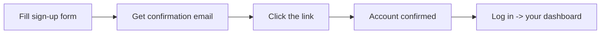
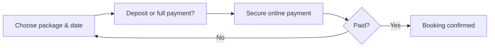
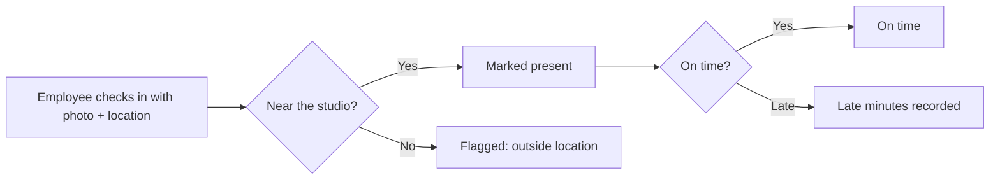
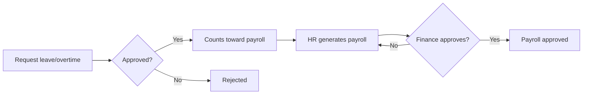
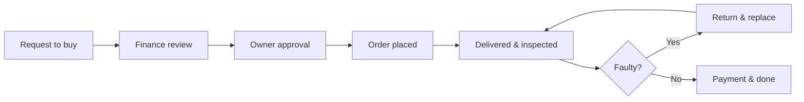
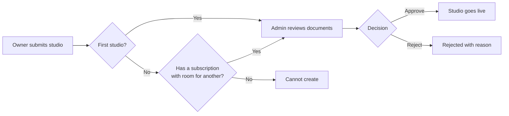
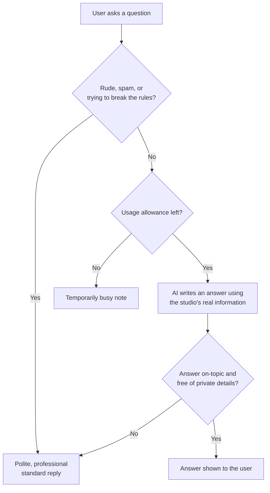

# Plain-Language Analysis — Laravel Studio Platform

> **What this document is:** a non-technical companion to `TECHNICAL ANALYSIS.md`. It explains what
> the system is, who uses it, and how it works — in everyday language. A glossary at the end translates
> every technical term.
> **Phase:** Analysis only. Nothing in the software was changed.
> **How current is this:** it describes the system as it stood in June 2026, before the first three
> rounds of improvement work were carried out. Points since addressed are marked inline. For what has
> actually been built since, see `../03-PROGRESS/NON TECHNICAL ROADMAP PROGRESS.md`.

---

## 1. What this system is

**Laravel Studio is an online platform for the photography business.** Think of it as two things in one:

1. **A marketplace** — where customers find and book photographers, either an established **studio**
   or an independent **freelancer**, pay a deposit or the full amount online, and later receive their
   photos through an online gallery.
2. **A back-office system for studios** — tools a studio needs to actually run as a business: managing
   staff, tracking attendance, calculating payroll, handling purchase requests for equipment, and
   answering customer questions with an AI assistant.

In short: it connects clients with photographers **and** gives studios the administrative machinery to
operate, all in one website.

---

## 2. Who uses it

The system has **seven types of users**, each with their own private area ("portal") and their own menu:

| User | In plain terms |
|---|---|
| **Admin** | The platform operator. Approves new studios, manages categories and locations, oversees everyone. |
| **Studio Owner** | Runs a photography studio. Manages packages, bookings, staff, payroll, and purchases. |
| **Client** | A customer. Browses, books a shoot, pays, views their gallery, leaves reviews. |
| **Freelancer** | An independent photographer (no studio). Lists their services and takes bookings directly. |
| **Studio HR** | The studio's human-resources person. Handles attendance, leave, overtime, and prepares payroll. |
| **Studio Finance** | The studio's finance person. Reviews and approves payroll and purchase payments. |
| **Studio Photographer** | A photographer employed by a studio. Checks in for shifts, sees assigned jobs, uploads photos. |

Each person only sees what their role allows — a client never sees payroll, a photographer never sees
admin tools, and so on.

---

## 3. What you can do in it

**As a Client:** search studios/freelancers, pick a package, choose a date and location, pay a deposit
or in full online, track your booking, download your photos from the gallery, rate your photographer,
keep a personal budget, and ask the AI assistant questions about photography services.

**As a Studio Owner:** register your studio, set up packages and services, accept bookings, assign
photographers to jobs, manage employees and their schedules, set up payroll rules, approve purchase
requests, configure your AI assistant, and view dashboards of your business.

**As a Freelancer:** build a profile, list services and packages, set your deposit policy, take
bookings, and deliver galleries.

**As Studio HR / Finance:** record and review attendance, approve or reject leave and overtime, generate
payroll, and approve purchases and payments.

**As a Studio Photographer:** check in and out of shifts (with location verification), see your assigned
shoots, request leave or overtime, and upload finished photos.

**As an Admin:** approve or reject new studios, manage the master lists (categories, locations,
subscription plans), and monitor the whole platform.

---

## 4. How it works, step by step

Below are the main journeys through the system, each with a simple diagram.

### 4.1 Signing up

You register, the system emails you a confirmation link, you click it (within 24 hours), and then you
can log in. After login, the system automatically takes you to the right home screen for your role.

### 4.2 Booking and paying

A client picks a photographer and package, chooses to pay a deposit or the full price, and is sent to a
secure payment page (GCash, card, etc.). Once payment succeeds, the booking is confirmed.

### 4.3 The shoot and the photos

After a booking is confirmed, the studio owner assigns photographers. On the event day the job is "in
progress". Afterward, photos are uploaded to an online gallery; the booking is only marked "completed"
once the photos are actually there. Then the client can leave a review.

### 4.4 Staff attendance

When a studio employee checks in, the system records their location and compares it to the studio's
location. If they're too far away, it flags it; it also notes whether they were on time or late.

### 4.5 Leave, overtime, and payroll

An employee requests leave or overtime; HR, the owner, or finance approves or rejects it. When it's time
to pay staff, HR generates the payroll using attendance and the studio's pay rules, and Finance reviews
and approves it.

### 4.6 Buying equipment (procurement)

When a studio needs to buy something, a staff member raises a request. Finance reviews it, the owner
approves it, an order is placed, the goods are delivered and inspected (faulty items can be returned),
and finally the payment is processed.

### 4.7 A new studio joining

A studio owner signs up and submits their studio (with business permit and ID). Their **first** studio
needs no subscription; a second or later one does. An admin reviews the documents and either approves
the studio (it goes live in the marketplace) or rejects it with a note.

*(Update 27 July 2026: this section previously said an owner needs an active subscription to create a
studio at all. That is wrong — the first studio is free, and the subscription requirement only applies
from the second one onward. It is also the **only** place on the whole platform where a subscription is
required for anything. See `docs/04-REFERENCE/SUBSCRIPTION LIFECYCLE.md`.)*

### 4.8 The AI assistant

Each studio has an AI assistant that clients, the owner, and studio photographers can all chat with. It
writes its answers fresh each time rather than picking from a list of pre-written replies, and it works
from the studio's real information — current packages and prices, plus any facts the owner has added
under *Studio Knowledge*.

It only talks about photography services: bookings, packages, prices, what's included, services,
schedules, and how to reach the team. Anything else gets a polite note that it can only help with
photography questions, along with an invitation to ask one.

Several safety checks run around every message. Before a question is sent to the AI, the system screens
out spam, rude language, and attempts to trick the assistant into breaking its rules or revealing
private technical information. After the AI answers, the reply is checked again before anyone sees it —
if it drifts off-topic or contains anything that looks like a password or internal setting, the whole
reply is thrown away and a safe message is shown instead. If the AI service is unavailable or the
studio's daily usage allowance runs out, users simply see a short "temporarily unavailable" note. No
technical details are ever shown, and a user who hits any of these messages can carry on normally with
their next question.

---

## 5. What it's built with

The platform is a **web application** built on **Laravel** (a popular, well-supported toolkit for
building websites in the PHP programming language). Pages are generated on the server and styled with
**Tailwind**. Information is stored in a **relational database** (organized tables that link to each
other). Online payments go through **PayMongo** and **Stripe**, and the AI assistant is powered by
**Groq** (an AI service the system calls from the server, never from your browser). It is a single, self-contained website — not a collection of separate apps.

---

## 6. Current state & honest caveats

**What's solid:**
- A clear, well-organized separation between the seven user types.
- A complete end-to-end business flow: from booking and payment through to photo delivery and reviews.
- Genuinely deep studio back-office features (attendance with location checks, detailed payroll rules,
  a full purchase-approval process).
- The AI assistant is the most thoroughly tested part of the system, including its security behavior.

**What's thin or worth noting:**
- **Limited automated testing** outside the AI assistant. Many areas only check that pages exist, not that
  the logic behind them is correct — so changes carry more risk of unnoticed bugs. *(Partly improved
  since: the payment-confirmation path now has its own automated checks.)*
- **Two payment systems** (PayMongo and Stripe) are wired in slightly inconsistently, which can be
  confusing to maintain. *(Partly improved since: PayMongo's settings were moved alongside Stripe's.)*
- A few business rules (like the "high-value purchase" amount) are **fixed in the code** rather than
  adjustable in settings.
- By default, the system is configured to **only log emails** rather than send them — fine for
  development, but must be switched on for real use.
- Login works for the website only; there's **no separate login system for a mobile app** yet.

None of these are broken features — they're areas a future team should be aware of.

---

## 7. Glossary

| Term | Plain meaning |
|---|---|
| **API** | A way for two pieces of software to talk to each other (e.g. the app talking to PayMongo). |
| **Back-office** | The behind-the-scenes admin tools a business uses (staff, payroll, purchasing). |
| **Blade** | Laravel's system for building web pages on the server before sending them to your browser. |
| **AI assistant** | An assistant that writes its own answers to questions, rather than picking from pre-written replies. |
| **Groq** | The outside AI service that generates the assistant's answers. The app calls it from the server. |
| **Guardrail** | An automatic safety check on what goes into the AI and what comes back out of it. |
| **Prompt injection** | A message crafted to trick an AI into ignoring its rules or leaking private information. |
| **Database (relational)** | An organized store of information in linked tables (e.g. a Bookings table linked to a Users table). |
| **Dashboard** | A summary screen showing key numbers and activity for your role. |
| **Deposit** | A partial up-front payment; the rest is paid later. |
| **ER diagram** | A picture showing how the database tables relate to each other. |
| **Freelancer** | An independent photographer who works without a studio. |
| **Geofence / geolocation** | Using GPS location to check whether someone is physically at the studio (used for attendance). |
| **Laravel** | The web-development toolkit (framework) the whole system is built on. |
| **Middleware** | A security checkpoint that decides whether a user is allowed to open a given page. |
| **Migration** | A script that sets up or updates the structure of the database tables. |
| **Payroll** | The calculation of how much each employee is paid, including deductions. |
| **PayMongo / Stripe** | Online payment services that handle card and e-wallet payments securely. |
| **Portal** | The private area of the website tailored to one type of user (e.g. the Client portal). |
| **Procurement** | The process of requesting, approving, ordering, and paying for equipment/supplies. |
| **Queue** | A waiting line for background tasks (like sending emails) so the website stays fast. |
| **RBAC (Role-Based Access Control)** | Giving people permissions based on their role, so each user only sees what they should. |
| **Seeder** | A script that fills the database with starter/sample data. |
| **Subscription** | A recurring plan a studio pays for to use the platform. |
| **Tailwind** | The styling system that controls how pages look. |
| **Webhook** | An automatic message a payment service sends back to the app to confirm something happened (e.g. "payment received"). |
