# Technical Analysis — Laravel Studio Platform

> **Phase:** Analysis only. No code was changed to produce this document.
> **Date of scan:** 2026-06-24
> **Audience:** Developers, reviewers, technical evaluators.
>
> **Currency:** this is a dated snapshot taken before roadmap Phases 1–3 were implemented. Findings
> since addressed are marked inline with *(resolved in Phase N)*. For current status see
> [`../03-PROGRESS/ROADMAP PROGRESS.md`](../03-PROGRESS/ROADMAP%20PROGRESS.md).

---

## 1. Scope & Boundaries

- **Single repository, single Laravel application.** No micro-services, no separate frontend repo, no
  mobile app in-tree. One deployable web app.
- **In scope:** `app/`, `routes/`, `database/` (migrations, seeders, factories), `resources/`
  (Blade views, JS, CSS), `config/`, `tests/`, root manifests (`composer.json`, `package.json`).
- **Excluded from analysis** (dependencies/artifacts, not part of the authored system):
  `vendor/`, `node_modules/`, `public/build/`, `storage/`, `bootstrap/cache/`.
- The repo also contains a `prompt/` folder of planning/spec documents — these are project artifacts,
  not application code.

---

## 2. Tech Stack & Versions

### Backend (`composer.json`)

| Dependency | Version constraint | Role |
|---|---|---|
| `php` | `^8.2` | Language runtime |
| `laravel/framework` | `^12.0` | Web framework (routing, ORM, queue, mail, auth) |
| `laravel/tinker` | `^2.10.1` | REPL / console |
| `paymongo/paymongo-php` | `^0.0.0` | PayMongo payment gateway (PH: GCash, cards, GrabPay, PayMaya) |
| `stripe/stripe-php` | `^19.3` | Stripe payment gateway (cards, subscriptions) |

**Dev dependencies:** `phpunit/phpunit ^11.5.3`, `laravel/pint ^1.24` (formatter), `laravel/pail ^1.2`
(log viewer), `laravel/sail ^1.41` (Docker dev), `fakerphp/faker ^1.23`, `mockery/mockery ^1.6`,
`nunomaduro/collision ^8.6`.

> Note: `paymongo/paymongo-php` is pinned at `^0.0.0` (a pre-1.0 package). The codebase calls the
> PayMongo REST API directly via HTTP rather than relying heavily on that SDK.

### Frontend (`package.json`)

| Dependency | Version | Role |
|---|---|---|
| `vite` | `^7.0.7` | Asset bundler / dev server |
| `laravel-vite-plugin` | `^2.0.0` | Laravel ↔ Vite integration |
| `tailwindcss` | `^4.0.0` | Utility-first CSS |
| `@tailwindcss/vite` | `^4.0.0` | Tailwind v4 Vite plugin |
| `axios` | `^1.11.0` | HTTP client (browser) |
| `concurrently` | `^9.0.1` | Runs dev processes together |

**Frontend model:** Server-rendered **Blade** templates (no SPA, no React/Vue). Plain JavaScript in
`resources/js/`. Styling via Tailwind v4.

### Runtime drivers (from `.env.example` / `config/*`)

| Concern | Default | Notes |
|---|---|---|
| Session | `database` | Sessions persisted to DB |
| Cache | `database` | DB-backed cache store |
| Queue | `database` | Jobs in DB; `php artisan queue:listen` in dev |
| Broadcast | `log` | No realtime broadcasting configured |
| Mail | `log` | Defaults to log driver; SMTP/SES/Postmark/Resend supported |
| Filesystem | `local` | Local disk; AWS S3 keys present but optional |

---

## 3. Database

**Type:** Relational. The app supports any Laravel-compatible RDBMS (SQLite, MySQL, MariaDB, PostgreSQL,
SQL Server). Key facts:

- `.env.example` ships `DB_CONNECTION=sqlite`.
- `CLAUDE.md` states the intended production DB is **MySQL**, database name `platinum`.
- Tests run against **SQLite `:memory:`**.
- **Naming conventions:** all tables use the `tbl_` prefix; many-to-many pivot tables use the `pvt_`
  prefix (e.g. `pvt_studio_categories`, `pvt_freelancer_categories`).
- ~101 migrations in `database/migrations/`; ~25 seeders in `database/seeders/`.
- **Soft deletes** are used on `BookingModel`, `LeaveRequestModel`, `OvertimeRequestModel`,
  `EmployeePayrollModel` (`deleted_at`).

### 3.1 Core entity-relationship overview

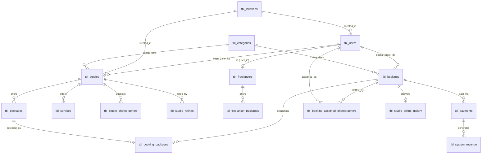

`tbl_bookings.booking_type` is `studio` or `freelancer`; `provider_id` points to a studio id or a
freelancer user id depending on type (polymorphic-by-convention, not a DB-level polymorphic relation).

### 3.2 Other table clusters (narrative)

- **RBAC:** `tbl_roles`, `tbl_permissions`, `tbl_role_permissions` (M:N), `tbl_user_roles` (M:N, with a
  `studio_id` pivot column so a role grant is scoped to a specific studio). Roles/permissions carry a
  `portal` tag and a `resource`/`action` decomposition.
- **HR / payroll:** `tbl_studio_employee_schedule`, `tbl_employee_attendance` (geofence + device
  metadata — covers studio photographers too; there is no separate photographer attendance table),
  `tbl_employee_payroll` (settings: rates, deductions, tax,
  schedule), `tbl_generated_payrolls` (computed runs), `tbl_leave_requests`, `tbl_overtime_requests`.
- **Procurement:** `tbl_procurement_requests` + items, `tbl_procurement_purchase_orders` + items,
  `tbl_procurement_documents`, `tbl_procurement_audit_trails`, `tbl_procurement_assets`,
  `tbl_procurement_inventory_stocks`, `tbl_procurement_defect_returns`.
- **Subscriptions / revenue:** `tbl_subscription_plans`, `tbl_studio_plans`, `tbl_freelancer_plans`,
  `tbl_system_revenue`.
- **AI assistant:** config, studio knowledge entries (formerly intents), quick replies, conversations, messages (per studio owner).
- **Misc:** `tbl_notifications`, `tbl_client_budget`.

---

## 4. System Architecture

### 4.1 Multi-portal model

The platform is one app split into **7 role portals**. `UserModel.role` selects the portal; each
portal maps to a middleware, a route prefix, a controller namespace, and a view directory.

| Role(s) | Middleware | Prefix | Controller ns | View dir |
|---|---|---|---|---|
| `admin` | `AdminMiddleware` | `/admin` | `Admin\` | `admin/` |
| `owner`, `owner-super-admin` | `OwnerMiddleware` | `/owner` | `StudioOwner\` | `owner/` |
| `client` | `ClientMiddleware` | `/client` | `Client\` | `client/` |
| `freelancer` | `FreelancerMiddleware` | `/freelancer` | `Freelancer\` | `freelancer/` |
| `studio-hr*` | `StudioHRMiddleware` | `/studio-hr` | `StudioHR\` | `studio-hr/` |
| `studio-finance*` | `StudioFinanceMiddleware` | `/studio-finance` | `Finance\` | `studio-finance/` |
| `studio-photographer` | `StudioPhotographerMiddleware` | `/studio-photographer` | `StudioPhotographer\` | `studio-photographer/` |

All routes live in a single `routes/web.php` (~668 lines, ~400 endpoints). ~60 controllers across the
portal namespaces, plus shared `GeneralProfileController` and `NotificationController`.

### 4.2 Request lifecycle & layering

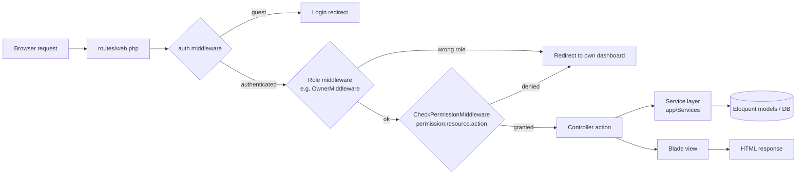

Authorization is **two-layered**: role middleware gates the portal prefix, then
`CheckPermissionMiddleware` enforces granular `resource.action` permissions (supports comma-separated
OR logic and resolves `studio_id` from the route/input so permissions are studio-scoped).

### 4.3 Services layer (`app/Services/`)

| Service | Purpose |
|---|---|
| `PaymongoService` | PayMongo REST API: checkout sessions, payment intents (3-D Secure), payment links, status checks. Card-only in test mode; GCash/GrabPay/PayMaya in live. |
| `StripeService` | Stripe: checkout sessions, subscription checkout, payment intents, webhook signature verification. |
| `ChatbotService` | Photography AI assistant: sanitize → moderation → guard → Groq → output guard; per-owner config and live studio context. |
| `Ai/GroqClient` | Groq chat-completions transport. The only class that reads `services.groq.api_key`; returns reason codes, never provider error text. |
| `Ai/ChatbotGuard` | Security guardrails: input sanitization, prompt-injection and credential-probe detection, output leak/echo detection, fixed fallback copy. |
| `Ai/GroqRateLimiter` | Cache-based request and token budget windows sitting under the provider's published limits. |
| `AttendanceGeolocationService` | Haversine distance between employee coords and studio geofence; returns distance + status (`WITHIN_GEOFENCE` / `OUTSIDE_GEOFENCE` / `MISSING_STUDIO_PIN`). No external API. |
| `PhotographerAvailabilityService` | Checks leave requests + conflicting assignments to decide availability for booking dates. |
| `ProcurementWorkflowService` | State machine for the procurement lifecycle; audit trails, defect returns, assets, inventory. Constants: `HIGH_VALUE_THRESHOLD=50000`, `OVERDUE_HOURS=48`. |
| `Dashboard/*` | One service per portal (`Admin`, `Owner`, `Hr`, `Finance`, `Photographer`) extending `BaseDashboardService`; `DashboardCsvExporter` for exports. |

### 4.4 Layer diagram

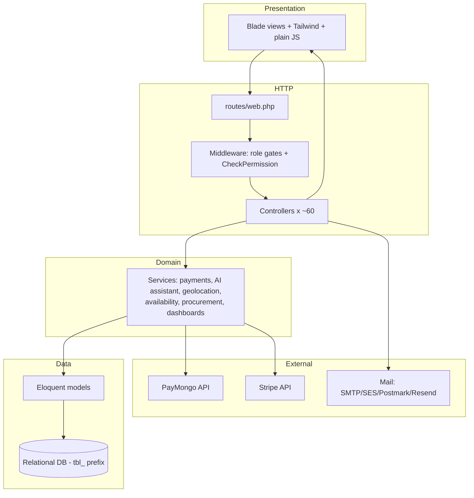

---

## 5. Process & Flow (Flowcharts)

Each flowchart reflects actual statuses/branches found in the models, controllers, and services.

### 5.1 Registration & email verification

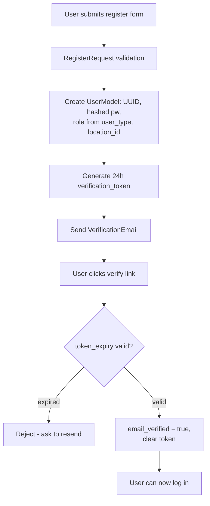

### 5.2 Login & dashboard routing

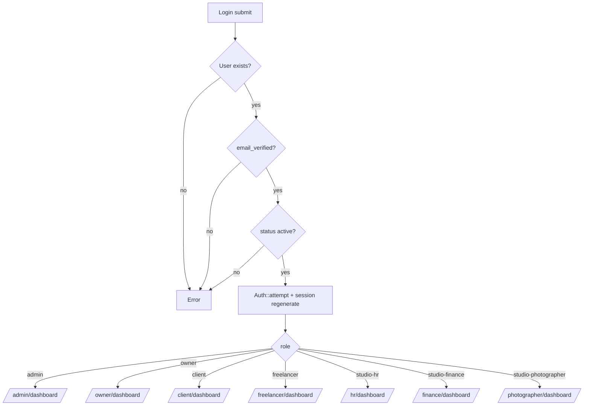

### 5.3 Client booking + payment

`BookingModel` statuses: `pending → confirmed → in_progress → completed | cancelled`.
Payment statuses: `pending → partially_paid → paid | failed | refunded`.

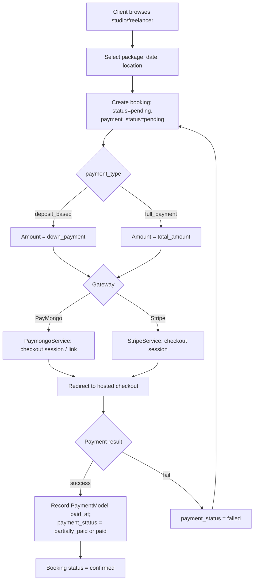

### 5.4 Photographer assignment & completion

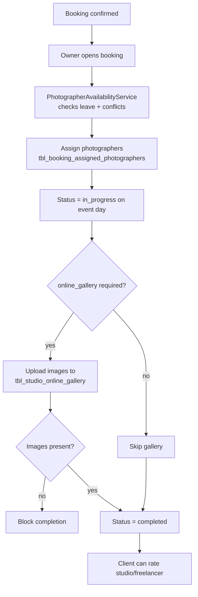

### 5.5 Attendance check-in/out (geofenced)

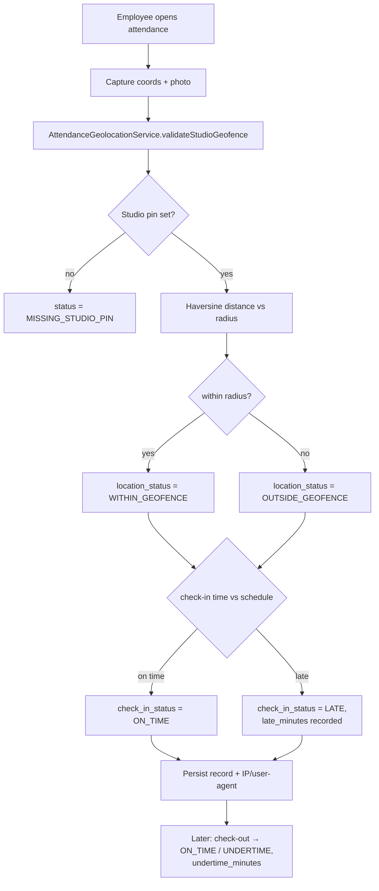

### 5.6 Leave / overtime request → approval

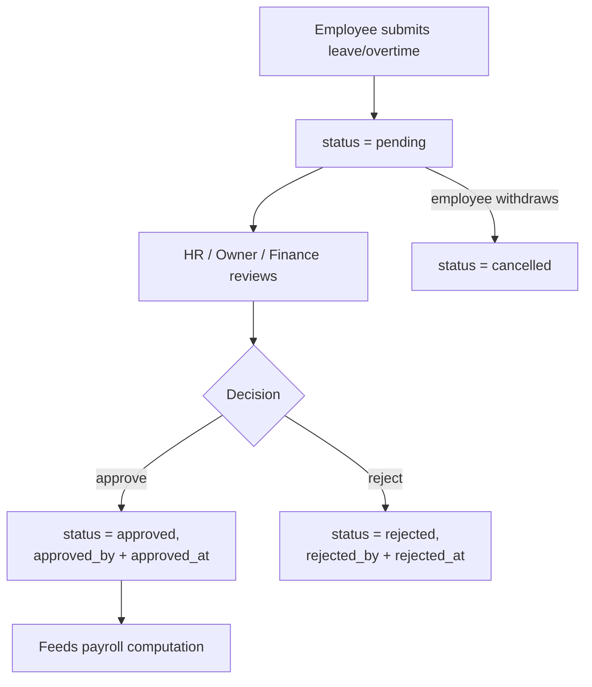

### 5.7 Payroll generation → review → approval

`tbl_generated_payrolls.status`: generated as `pending`, then `approved` or `rejected` by Finance.

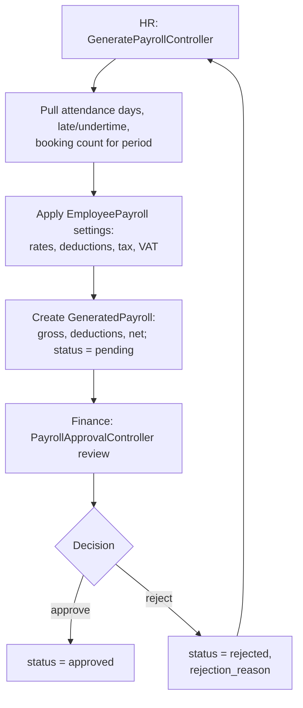

### 5.8 Procurement lifecycle (14 states)

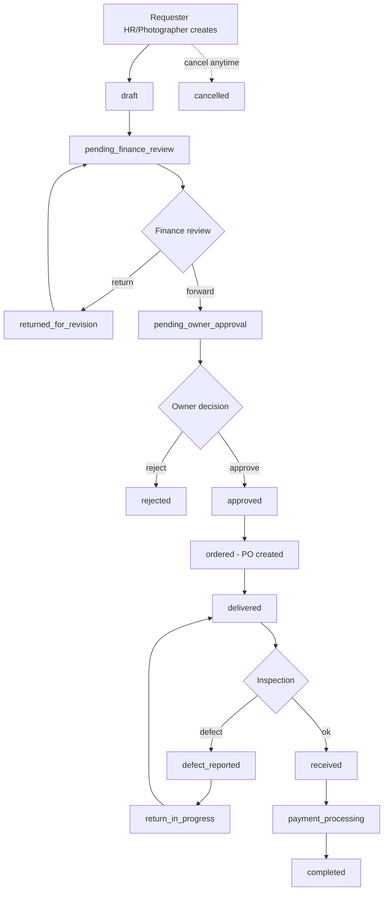

### 5.9 Studio onboarding & admin approval

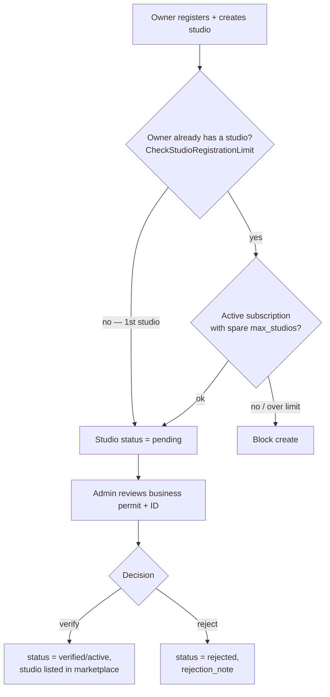

*(Update 2026-07-27, `prompt/tasks/08.md`: the flowchart previously showed the subscription check
gating **all** studio creation. It does not. `CheckStudioRegistrationLimit` lets every GET through
unconditionally, and on POST only checks a subscription when the owner already has at least one
studio — **the first studio is free.** It also returns early unless `$user->role === 'owner'`, so
`owner-super-admin` bypasses it entirely. This is the only subscription check on the platform; see
[`SUBSCRIPTION LIFECYCLE.md`](../04-REFERENCE/SUBSCRIPTION%20LIFECYCLE.md) §1.3.)*

### 5.10 AI assistant message handling

Groq-backed, photography-scope-only. Guardrails run on both sides of the model
call, and any layer that trips returns fixed fallback copy. Full reference:
[AI ASSISTANT INTEGRATION.md](../04-REFERENCE/AI%20ASSISTANT%20INTEGRATION.md).

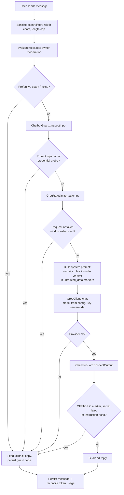

---

## 6. Conditional Technical Details

### 6.1 API / endpoint inventory (server-rendered web routes, grouped by portal)

> All endpoints are Blade-backed web routes under `auth` + role middleware (no public JSON API).
> Counts are approximate from `routes/web.php`.

| Portal | Prefix | ~Endpoints | Representative resources |
|---|---|---|---|
| Auth | — | ~8 | login, register, verify-email, logout |
| Admin | `/admin` | ~40 | users, studios (approve/reject), freelancers, categories, locations, subscriptions, dashboard+export |
| Owner | `/owner` | ~120 | studios, bookings (assign/status), employees, schedules, packages, services, payroll settings, roles, permissions, AI assistant config + studio knowledge, procurement approval, online gallery |
| Studio HR | `/studio-hr` | ~65 | employees, attendance, leave, overtime, payroll settings, generate payroll, procurement requests |
| Finance | `/studio-finance` | ~35 | dashboard, attendance, leave/overtime, payroll approval, procurement review/PO/delivery/payment |
| Freelancer | `/freelancer` | ~40 | profile, services, packages, bookings, member invitations, online gallery |
| Photographer | `/studio-photographer` | ~40 | attendance, assigned studios/bookings, leave/overtime, online gallery, procurement requests |
| Client | `/client` | ~55 | booking form + payment, my bookings (cancel/pay/confirm), gallery, studio/freelancer ratings, budget |
| Shared (`auth`) | — | ~15 | notifications, profile, home redirect, AI assistant (`/chatbot/*`, cross-portal) |

### 6.2 Third-party integrations

| Integration | Where | Key flows | Config keys |
|---|---|---|---|
| **PayMongo** | `PaymongoService` | Checkout sessions, payment intents (3-D Secure), payment links w/ redirect, status retrieval. v1 REST API, HTTP Basic auth. | `services.paymongo.secret_key`, `.public_key`, `.base_url`, `.mode` |
| **Stripe** | `StripeService`, `Client\BookingController` | Checkout sessions, subscription checkout, payment intents, webhook signature verification. | `services.stripe.secret_key`, `.public_key`, `.webhook_secret`, `.mode` |
| **Groq (AI assistant)** | `Ai/GroqClient`, `ChatbotService`, `ChatbotConfigController` | Chat completions for photography-scope conversations; server-side only, guardrails on input and output, cache-based request/token budgets. | `services.groq.api_key`, `.model`, `.base_url`, `.timeout`, `.max_tokens`, `.temperature`, `.limits.*` |
| **Mail** | Laravel mailer | Verification emails, transactional templates in `resources/views/emails/`. | `MAIL_*`; Postmark/Resend/SES blocks in `config/services.php` |
| **Geolocation** | `AttendanceGeolocationService` | Local Haversine; **no external API**. | studio `attendance_latitude/longitude/radius_meters` |
| **Slack** | `config/services.php` block present | Not wired into app logic observed. | `services.slack.*` |
| **AWS S3** | optional filesystem disk | Off by default (`FILESYSTEM_DISK=local`). | `AWS_*` |

### 6.3 Environment / config overview (key names only — no secret values)

- **App:** `APP_NAME`, `APP_ENV`, `APP_DEBUG`, `APP_URL`, `APP_LOCALE`, `BCRYPT_ROUNDS`, `LOG_CHANNEL`, `LOG_LEVEL`.
- **DB:** `DB_CONNECTION` (+ `DB_HOST/PORT/DATABASE/USERNAME/PASSWORD` for MySQL).
- **Session/Cache/Queue:** `SESSION_DRIVER`, `SESSION_LIFETIME`, `CACHE_STORE`, `QUEUE_CONNECTION`, `BROADCAST_CONNECTION`.
- **Mail:** `MAIL_MAILER`, `MAIL_HOST`, `MAIL_PORT`, `MAIL_USERNAME`, `MAIL_PASSWORD`, `MAIL_FROM_ADDRESS`, `MAIL_FROM_NAME`.
- **Payments:** PayMongo + Stripe keys/mode (see 6.2).
- **AI assistant:** `GROQ_API_KEY` (server-side only, never `VITE_`-prefixed), `GROQ_MODEL` (default `qwen/qwen3.6-27b`), `GROQ_BASE_URL`, `GROQ_TIMEOUT`, `GROQ_MAX_TOKENS`, `GROQ_TEMPERATURE`, `GROQ_LIMIT_RPM/RPD/TPM/TPD/USER_RPM`, `GROQ_HISTORY_MESSAGES/CHARACTERS`.
- **AWS (optional):** `AWS_ACCESS_KEY_ID`, `AWS_SECRET_ACCESS_KEY`, `AWS_DEFAULT_REGION`, `AWS_BUCKET`.

### 6.4 Authentication

- **Guard:** `web`, session driver, Eloquent provider on `App\Models\UserModel` (table `tbl_users`).
- **Flow:** register → email verification token (24 h) → login checks `email_verified` + active `status`
  → `Auth::attempt` with session regeneration → role-based dashboard redirect.
- **Password reset:** `password_reset_tokens`, 60-min expiry, 60-sec throttle.
- **No API-token auth** (no Sanctum/Passport): web-session only.

---

## 7. Known Issues, Gaps, Assumptions & Limitations

### Technical debt / quality signals

- **No `TODO`/`FIXME`/`HACK` markers** found in `app/` or `resources/` — either clean or tracked externally.
- **Config asymmetry:** Stripe config lives in `config/services.php`; PayMongo config is read in the
  service constructor. Inconsistent and harder to discover. *(Resolved in Phase 1.5 — a `paymongo`
  block was added to `config/services.php`.)*
- **Dual payment providers** (PayMongo + Stripe) with different capabilities and no explicit
  selection/strategy abstraction.
- **Hardcoded thresholds:** `ProcurementWorkflowService::HIGH_VALUE_THRESHOLD = 50000` (and
  `OVERDUE_HOURS`, `DUPLICATE_LOOKBACK_DAYS`) are constants, not per-studio/env config.
- **Mail defaults to `log`** in `.env.example` — risk of shipping without a real mailer.
- **Single 668-line `routes/web.php`** carrying ~400 routes — large surface, no per-portal route files.
  *(Still true and growing: 688 lines / ~440 routes after Phases 1–3.)*

### Test coverage

- Strong: the AI assistant. `ChatbotFeatureTest` (happy path, prompt assembly, moderation, history) plus
  `ChatbotAiGuardrailsTest` (injection, credential leakage, off-topic enforcement, provider failures,
  budget exhaustion, session ownership) and `ChatbotDefaultConfigSeederTest`. Both feature suites use
  `Http::fake()` + `Http::preventStrayRequests()`, so they need no API key and never reach the network.
- Thin: most Dashboard / Procurement / Payroll tests assert **route registration only**, not behavior.
- Gaps: no PayMongo/Stripe integration tests (the `Http::fake()` pattern established for Groq applies directly), no auth-controller tests, no geolocation tests.
  *(Partly addressed in Phase 1.5 — `tests/Feature/Payment/WebhookTest.php` now covers the webhook
  handlers. Auth and geolocation remain untested.)*

### Assumptions made in this analysis

- Endpoint counts are approximate (derived from route grouping, not exhaustively enumerated).
- The intended production DB is MySQL (`platinum`) per `CLAUDE.md`, despite `.env.example` shipping SQLite.
- Procurement transition ordering (5.8) reflects the status constants and service intent; exact guard
  conditions for each edge were not line-by-line traced.

### Limitations of the scan

- Runtime behavior (live payment callbacks, webhook delivery, email sending) was **not executed** — this
  is a static read-only analysis.
- No external/secret config values were inspected (only key names).
- Some Blade-side JS behavior was summarized at directory level, not file-by-file.
