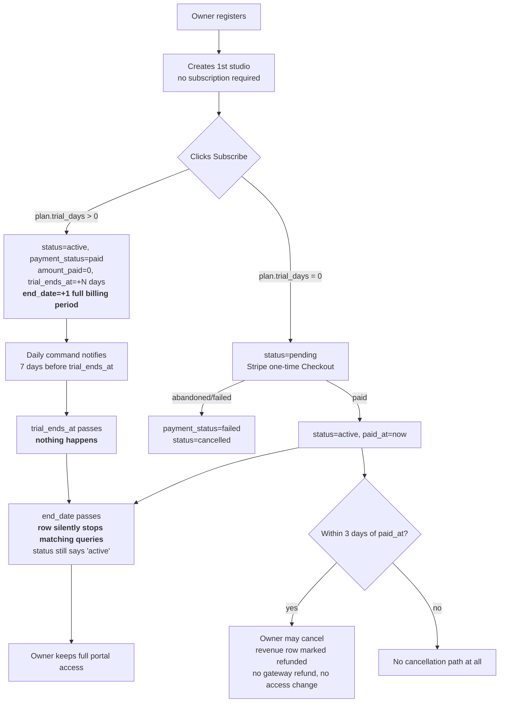
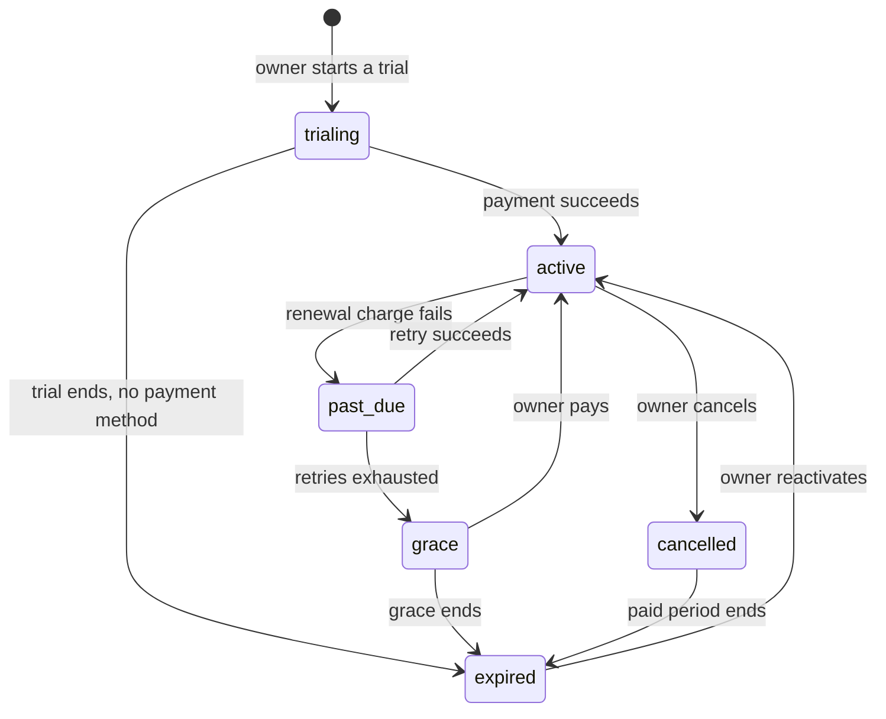

# Studio Owner Subscription Lifecycle

> **Status: analysis and recommendation. Nothing in §5–§8 is implemented.**
>   Source brief: `prompt/tasks/08.md`. Task report: [`prompt/output/08.md`](../../prompt/output/08.md).
>   Scan date 2026-07-27, against `main`.
>
>   This document exists because the subscription lifecycle is currently described in three
>   places that disagree with each other and with the code. It records what the platform
>   actually does today (§1–§3), corrects the documentation that misstates it (§4), and
>   proposes a single lifecycle to build toward (§5–§8). It feeds roadmap **Phase 10**.
>
> **Start here if you only read one section:** §1.3 — the two sentences that summarise the
> whole problem. A free trial never ends, and an expired subscription takes nothing away.

---

## 1. The lifecycle as built

Subscriptions live in two tables. `tbl_subscription_plans` is the **catalog** the admin
maintains; `tbl_studio_plans` is a **studio's actual subscription**.

### 1.1 The states that exist in the schema

`tbl_studio_plans.status` is an enum of four values, defaulting to `pending`
([migration](../../database/migrations/2026_02_19_084644_create_tbl_studio_plans.php)):

| Status | Written by | Reachable? |
|---|---|---|
| `pending` | Column default, and the paid branch of [`SubscriptionController::subscribe()`](../../app/Http/Controllers/StudioOwner/SubscriptionController.php#L171) | Yes |
| `active` | Trial branch [`#L155`](../../app/Http/Controllers/StudioOwner/SubscriptionController.php#L155); `verifyPayment()` [`#L639`](../../app/Http/Controllers/StudioOwner/SubscriptionController.php#L639) | Yes |
| `cancelled` | `cancel()` [`#L753`](../../app/Http/Controllers/StudioOwner/SubscriptionController.php#L753); also `paymentFailed()` [`#L397`](../../app/Http/Controllers/StudioOwner/SubscriptionController.php#L397) | Yes |
| `expired` | — | **No. Never written by any code path.** |

`payment_status` is a second enum — `pending`, `paid`, `failed`, `refunded` — and `refunded`
is likewise never written on this table. The revenue row is flipped to `refunded` instead
([`#L759-772`](../../app/Http/Controllers/StudioOwner/SubscriptionController.php#L759)).

### 1.2 What actually happens

### 1.3 The two findings that matter

**A free trial never ends.** The trial branch sets `trial_ends_at = now() + trial_days`
but sets `end_date` from `calculateEndDate()`
([`#L151`](../../app/Http/Controllers/StudioOwner/SubscriptionController.php#L151),
[`#L291`](../../app/Http/Controllers/StudioOwner/SubscriptionController.php#L291)), which
returns a **full billing period** — `now()->addMonth()` or `addYear()`. Since
[`StudioPlanModel::isActive()`](../../app/Models/StudioPlanModel.php#L124) tests `status`,
`end_date` and `payment_status` and never looks at `trial_ends_at`, a 14-day trial on the
seeded *Studio Growth* plan grants **30 days** of fully active, fully paid-looking access
for ₱0. On the yearly plan, a 30-day trial grants **365 days**. Nothing anywhere compares
`trial_ends_at` to the current time in order to change state.

**An expired subscription takes nothing away.**
[`OwnerMiddleware`](../../app/Http/Middleware/OwnerMiddleware.php#L20) checks
authentication and role and nothing else. There is no `app/Policies` directory and no
`Gate::` definition in the application. The single subscription-aware middleware,
[`CheckStudioRegistrationLimit`](../../app/Http/Middleware/CheckStudioRegistrationLimit.php),
is registered on exactly two routes ([`routes/web.php#L141`](../../routes/web.php#L141)),
lets the GET through unconditionally
([`#L60-62`](../../app/Http/Middleware/CheckStudioRegistrationLimit.php#L60)), and only
blocks the POST when the owner **already has at least one studio**
([`#L67`](../../app/Http/Middleware/CheckStudioRegistrationLimit.php#L67)). Every other
owner route — bookings, packages, employees, payroll, procurement, galleries, HR, the
marketplace listing — is reachable with no subscription, an expired one, or a cancelled one.

---

## 2. The trial

Shipped in roadmap 3.4 and recorded as ⚠️ partial in
[`ROADMAP PROGRESS.md`](../03-PROGRESS/ROADMAP%20PROGRESS.md). Four defects, all verified
against source:

### 2.1 `end_date` does not respect the trial length

Covered in §1.3. The consequence is not only free access: because `end_date` is the only
date any query filters on, the trial and the paid period are indistinguishable to every
read site in the codebase.

### 2.2 No payment method is collected at trial start

The trial branch returns before any Stripe call
([`#L161-167`](../../app/Http/Controllers/StudioOwner/SubscriptionController.php#L161)).
No customer object, no `SetupIntent`, no card on file. **The trial therefore cannot
convert.** The owner's card is never charged, and there is nothing to charge it with.

### 2.3 The trial-ending notification points at a control that does not exist

[`notifyTrialEnding()`](../../app/Traits/Notifiable.php#L367) tells the owner to *"Add a
payment method to keep your plan active."* There is no payment-method screen, route, or
column anywhere in the platform. The instruction is unfollowable.

### 2.4 Nothing expires the trial

[`NotifyTrialEndingCommand`](../../app/Console/Commands/NotifyTrialEndingCommand.php#L31)
is the only consumer of `trial_ends_at`. It writes an in-app notification and returns; it
never mutates the subscription. The scheduler
([`routes/console.php#L11-13`](../../routes/console.php#L11)) registers three commands, and
none of the other two touch subscriptions.

---

## 3. The gaps

### 3.1 There is no expiry job

`bookings:expire-pending` exists and is the pattern a subscription equivalent would copy,
but no command reads `end_date` or `trial_ends_at` to transition a row. Expiry is *implicit*
— it emerges from the `end_date >= now()` filter in the three read sites
([`CheckStudioRegistrationLimit#L42`](../../app/Http/Middleware/CheckStudioRegistrationLimit.php#L42),
[`SubscriptionController::subscribe#L129`](../../app/Http/Controllers/StudioOwner/SubscriptionController.php#L129),
[`StudioPlanModel::isActive#L127`](../../app/Models/StudioPlanModel.php#L127)) — and is
therefore invisible in the database, in reports, and to the owner.

### 3.2 The `expired` state is declared and unreachable

A column that can hold a value no code writes is a promise the schema makes and the
application breaks. Any report, filter, or badge keyed on `status = 'expired'` returns
nothing, forever.

### 3.3 There is no access restriction

Covered in §1.3. **This is the single largest gap**: the platform's revenue model rests on
subscriptions, and nothing on the platform depends on having one. A studio owner who never
subscribes at all keeps a marketplace-listed studio and an unrestricted portal.

### 3.4 There is no grace period or `past_due` state

No column, no config value, no code. A subscription is active or it is nothing; there is no
representation of "payment is late but you are not cut off yet."

### 3.5 There is no renewal

`next_billing_date` is written on every subscription
([`#L152`](../../app/Http/Controllers/StudioOwner/SubscriptionController.php#L152),
[`#L177`](../../app/Http/Controllers/StudioOwner/SubscriptionController.php#L177)),
indexed by the migration, and **read by nothing**.
[`StripeService::createSubscriptionCheckoutSession()`](../../app/Services/StripeService.php#L79)
builds a Checkout Session with `'mode' => 'payment'`
([`#L100`](../../app/Services/StripeService.php#L100)) — a one-time charge. No Stripe
Product or Price, no Stripe subscription object, no customer, no saved payment method.
Renewal is therefore manual re-subscription, and even that is blocked while the old row
is still active (§3.9).

### 3.6 Cancellation is a 3-day refund window, not a cancellation feature

[`canBeCancelled()`](../../app/Models/StudioPlanModel.php#L168) permits cancellation only
within 3 days of `paid_at`. **After day 3 there is no way to cancel at all** — the owner
cannot stop a subscription they no longer want. What the window actually implements is a
cooling-off refund right, and even that is incomplete: it flips the `tbl_system_revenue`
row to `refunded` ([`#L763-766`](../../app/Http/Controllers/StudioOwner/SubscriptionController.php#L763))
without calling any gateway, so the platform's books say refunded while the money stays
with Stripe. It also does not revoke access, because there is no access to revoke (§3.3).

Note also that `cancel()` uses a direct `update(['status' => 'refunded'])` rather than
[`SystemRevenueModel::markAsRefunded()`](../../app/Models/SystemRevenueModel.php#L290),
which exists for exactly this.

### 3.7 There is no reactivation path

No route, controller method, or UI revives a `cancelled` or lapsed subscription. Because
`subscribe()` creates a brand-new row every time, an owner's subscription history is a pile
of disconnected records with no continuity between them — no concept of "the same
subscription, resumed."

### 3.8 There is no dunning

`payment_status = 'failed'` is written once, on the Stripe failure redirect
([`#L394-399`](../../app/Http/Controllers/StudioOwner/SubscriptionController.php#L394)),
and simultaneously sets `status = 'cancelled'`. There is no retry, no notification, no
escalation, and no distinction between "the owner clicked back out of Checkout" and "the
card was declined." Both destroy the subscription immediately. No route consumes
[`verifyWebhookSignature()`](../../app/Services/StripeService.php#L286), so an
asynchronous payment failure is never learned about at all.

### 3.9 Upgrade and downgrade are actively blocked

[`subscribe()#L132-137`](../../app/Http/Controllers/StudioOwner/SubscriptionController.php#L132)
rejects any subscribe attempt while an active subscription exists, with *"Please wait until
it expires or cancel it first."* Combined with §3.6, an owner past day 3 on a yearly plan
cannot upgrade, cannot downgrade, and cannot cancel — for the remainder of the year.

### 3.10 `notifySubscriptionExpiring()` is dead code

Defined at [`Notifiable.php#L343`](../../app/Traits/Notifiable.php#L343) and called from
nowhere in `app/`, `resources/`, or `routes/`. It is the ready-made hook for §7's reminder
ladder.

### 3.11 The subscription is per-studio, but the docs treat it as per-owner

`tbl_studio_plans.studio_id` keys the subscription to a **studio**. But
`CheckStudioRegistrationLimit` queries across *all* of the owner's studios and accepts any
one active subscription ([`#L38-44`](../../app/Http/Middleware/CheckStudioRegistrationLimit.php#L38)),
while `plan.max_studios` implies one subscription covering several studios. Both readings
are half-implemented. Every seeded studio plan sets `max_studios = 1`
([`FreshMarketplaceSeeder.php#L170`](../../database/seeders/Fresh/FreshMarketplaceSeeder.php#L170)),
so with seed data the multi-studio gate can never pass on any plan.

### 3.12 `owner-super-admin` bypasses the one gate that exists

`CheckStudioRegistrationLimit` returns early unless `$user->role === 'owner'`
([`#L25`](../../app/Http/Middleware/CheckStudioRegistrationLimit.php#L25)). The role
`owner-super-admin` is routed by `OwnerMiddleware` like any other owner but fails that
equality check, so it skips the subscription and studio-count checks entirely.

### 3.13 The freelancer side does not exist

`tbl_freelancer_plans` has **no `trial_ends_at` column** — the 3.4 migration added it to the
studio table only. There is no freelancer subscribe controller, route, or checkout path;
freelancer plan rows come from seeders and nothing else. The catalog nevertheless sells four
freelancer plans with trial days on two of them.

### 3.14 The admin cannot edit a plan

`Admin\SubscriptionController::edit()` renders `admin.edit-subscription-plans`, and that
Blade view does not exist. Pre-existing, already recorded in
[`ROADMAP PROGRESS.md`](../03-PROGRESS/ROADMAP%20PROGRESS.md). A trial length set at
creation cannot be changed afterwards.

---

## 4. What the existing documentation gets wrong

Three statements in the current docs are contradicted by the code. Corrected in this pass.

| Where | Says | Actually |
|---|---|---|
| [`TECHNICAL ANALYSIS.md`](../01-ANALYSIS/TECHNICAL%20ANALYSIS.md) §5.9 flowchart | `Owner registers + creates studio → {Active subscription? CheckStudioRegistrationLimit} → no: Block create` | The **first** studio needs no subscription. The gate fires only from the second onward, only on POST, and not at all for `owner-super-admin`. |
| [`NON TECHNICAL ANALYSIS.md`](../01-ANALYSIS/NON%20TECHNICAL%20ANALYSIS.md) §4.7 | *"They need an active subscription."* | Same correction, in the prose and the mermaid diagram. |
| [`CAPSTONE B IMPLEMENTATION ROADMAP.md`](../02-PLANNING/CAPSTONE%20B%20IMPLEMENTATION%20ROADMAP.md) 6.4 | *"On expiry: downgrade to free tier"* | **No free tier exists.** `plan_type` is `basic\|premium\|enterprise` and all eight seeded plans are priced (₱590–₱27,900). There is nothing to downgrade to. |

A fourth is stale rather than wrong:
[`REVISION CHECKLIST AND RECOMMENDATIONS.md`](../01-ANALYSIS/REVISION%20CHECKLIST%20AND%20RECOMMENDATIONS.md)
item 11 records "No free-trial period implemented," which was true at scan time and has since
become half-true.

---

## 5. Recommended lifecycle

> **This is a recommendation, not a decision.** It is offered so the platform has a default
> to argue with. The six choices in §8 are business decisions and are not settled here.

One subscription record moves through the states below. The design goals, in order:
**no silent state**, **no surprise cutoff**, **no data loss**, **a one-click way back**.

| State | Entered when | Duration | Owner is told | Access |
|---|---|---|---|---|
| `trialing` | Owner starts a plan with `trial_days > 0` | Exactly `trial_days` — `end_date` must equal `trial_ends_at` | On start, then T-7, T-3, T-1 | Full plan features |
| `active` | First successful charge, or a successful renewal | One billing cycle | Renewal notice at T-7 and T-3 | Full plan features |
| `past_due` | A renewal charge fails | Retry schedule (recommend D+1, D+3, D+7) | On each failed attempt, with a pay-now link | **Full features retained** — a failed card is usually a bank problem, not a decision to leave |
| `grace` | Retries exhausted, or a trial ended with no payment method | Recommend 7 days | On entry, then daily-decreasing countdown | Full features retained, with a persistent in-app banner |
| `expired` | Grace ends, or a cancelled subscription reaches its paid-period end | Indefinite | On entry, then a reactivation nudge at day 7 and day 30 | Restricted — see §6 |
| `cancelled` | The owner cancels | Until the end of the period already paid for | On request, confirming the exact end date | **Full features to the end of the paid period.** Cancel-at-period-end, never cancel-immediately |

Three rules that follow from the table:

1. **A trial's `end_date` is its `trial_ends_at`.** They are the same instant. The current
   split (§2.1) is the root cause of the free-access defect and must be closed before
   anything else in Phase 10.
2. **Expiry is a written state, not the absence of a row.** A scheduled command sets
   `expired` explicitly, so the transition has a timestamp, an audit trail, and a
   notification attached to it.
3. **Cancellation never takes away time already paid for.** The 3-day window (§3.6) is a
   refund policy and should be documented and named as one; the ability to *cancel* should
   be available at any time and take effect at the period end.

---

## 6. Post-expiration account handling

The brief's central question. The recommendation is **restrict, never delete**.

> Expiry is a billing event. It is not a moderation action, and it is not the owner asking
> to leave. Deleting an account or a studio on expiry destroys other people's records —
> clients' booking history, employees' payroll, the platform's own revenue ledger — to
> punish a lapsed card.

### 6.1 What survives expiry, permanently

- The `UserModel` row, the password, and the ability to sign in.
- Every studio, with its packages, services, staff, schedules, and verification status.
- All historical bookings, payments, galleries, payroll runs, attendance, and procurement.
- All `tbl_studio_plans` rows, as a subscription history.
- Read access to all of the above from the owner portal.

### 6.2 What stops at expiry

| Capability | After expiry | Why |
|---|---|---|
| Studio appears in the client marketplace | Hidden | The platform is selling distribution; this is the product |
| Accepting new bookings | Blocked | Follows from delisting |
| Creating additional studios | Blocked | Already the behaviour today (§1.3) |
| Adding staff, packages, services | Blocked | Subscription-tier limits are meaningless without an active tier |
| Editing existing packages and services | Blocked | Same |
| Chatbot / AI assistant on the studio page | Blocked | Per-tier feature |
| Reports and exports | Read-only, current data only | Data is theirs; the tooling is the product |

### 6.3 Bookings already in flight

**Existing paid bookings are honoured to completion regardless of subscription state.** The
client paid the studio and the platform took its commission; a lapsed subscription is a
dispute between the owner and the platform and must not reach the client. Concretely: an
expired studio keeps photographer assignment, gallery upload, and completion for any booking
that already exists — it simply cannot take new ones. This is decision **S5** and is the
one place where the recommendation carries real cost, because it means the access-restriction
layer has to be capability-scoped rather than a blanket portal lock.

### 6.4 Reactivation

Signing in, opening the subscription page, choosing a plan, and paying restores the studio to
`active` and re-lists it. Nothing is restored from a backup because nothing was removed.
Recommend that reactivation within 30 days resumes the previous plan by default (one click),
and that after 30 days the owner picks fresh from the current catalog.

---

## 7. Notification schedule

The lifecycle is only fair if every transition is announced before it happens. Existing
infrastructure covers two of these slots already.

| Event | When | Channel | Status today |
|---|---|---|---|
| Trial started | On activation | In-app | Not built (the JSON response is the only feedback) |
| Trial ending | T-7 | In-app | **Built** — [`notifyTrialEnding()`](../../app/Traits/Notifiable.php#L367) via `subscriptions:notify-trial-ending` |
| Trial ending | T-3, T-1 | In-app + email | Not built |
| Trial ended, entering grace | T+0 | In-app + email | Not built |
| Renewal upcoming | T-7, T-3 | In-app + email | **Method exists, unwired** — [`notifySubscriptionExpiring()`](../../app/Traits/Notifiable.php#L343) |
| Payment failed | D+0, D+3, D+7 | In-app + email | Not built |
| Entering grace | On transition | In-app + email | Not built |
| Expired | On transition | In-app + email | Not built |
| Reactivation nudge | +7d, +30d after expiry | Email | Not built |

Two notes. First, `app/Mail/` contains no subscription mailable — **every** notification in
the lifecycle today is in-app only, which means an owner who does not log in learns nothing.
Second, `NotifyTrialEndingCommand` already implements same-day de-duplication
([`#L47-54`](../../app/Console/Commands/NotifyTrialEndingCommand.php#L47)); the wider ladder
should reuse that approach rather than reinvent it.

---

## 8. Decisions required before implementation

None of these is a technical question. Each blocks specific Phase 10 items.

| # | Decision | Unblocks | Notes |
|---|---|---|---|
| **S1** | How long is the grace period after a trial ends or retries are exhausted? | 10.4, 10.6 | The recommendation is 7 days. Zero is a legitimate answer and makes 10.4 much smaller. |
| **S2** | Is a payment method required to *start* a trial? | 10.2, 10.8 | Card-required trials convert far better and make §5's `trialing → active` automatic; card-free trials get more signups. Card-required needs 10.8 (card on file) first, which does not exist. |
| **S3** | Exactly what stays available after expiry? | 10.5 | §6.2 is a proposal. The load-bearing question is whether the owner portal becomes read-only or merely feature-limited. |
| **S4** | Is a subscription scoped to a studio or to an owner? | 10.5, 10.7 | The schema says studio; the middleware and `max_studios` say owner. Both cannot stay. §3.11. |
| **S5** | Are in-flight paid bookings honoured after expiry? | 10.5 | §6.3 recommends yes. Answering no is simpler to build and exports the problem to the client. |
| **S6** | Is there a free tier at all? | 10.5, and roadmap 6.4 | Roadmap 6.4 assumes one exists. It does not. Either add a `free` plan type or delete "downgrade to free tier" from the plan — this pass took the second reading, provisionally. |

**Dependency:** S2 and S6 shape the state machine itself and should be settled first. S3, S4
and S5 all feed the access-restriction layer (10.5) and can be settled together. S1 is a
number and can be changed later without redesign.

---

## 9. Open questions and unknowns

1. **Freelancer subscriptions are unmodelled and unbuilt** (§3.13), yet the catalog sells
   them and the seeder creates rows. Whether freelancers get the same lifecycle or a
   different one is undecided, and this document does not cover them.
2. **Refunds cannot be executed.** Neither `PaymongoService` nor `StripeService` can issue a
   refund — the same finding that gates roadmap 9.5. Any subscription refund policy inherits
   that blocker.
3. **`Admin\SubscriptionController::edit()` has no view** (§3.14), so `trial_days` is
   write-once at plan creation.
4. **No webhook route exists**, so Stripe can never tell the platform anything
   asynchronously. Recurring billing (10.8) cannot be built before roadmap 1.5 lands.
5. **Proration on upgrade is undesigned.** Once §3.9's block is lifted, upgrading mid-cycle
   needs a credit rule that does not exist.
6. **`owner-super-admin`'s relationship to subscriptions is undefined** (§3.12) — it is an
   RBAC role assigned during studio creation, and whether it should be subject to billing
   gates at all has never been stated.
7. **What happens to a studio's employees when the subscription expires** is unaddressed
   here. Studio HR and finance staff sign in through their own portals, and §6.2 does not
   say whether their access follows the owner's.
8. **The platform's commission continues to work with no subscription**, since
   `SystemRevenueModel` takes its cut per booking. Whether an unsubscribed studio should be
   able to generate commission revenue is a business question nobody has posed.

---

## 10. What this changes today

Nothing. No code, schema, route, or runtime behaviour was modified for this analysis; the
brief was explicitly documentation-only. Three inaccurate statements in existing documents
were corrected (§4), and a new roadmap phase was added to hold the work.

Related documentation:

- [`02-PLANNING/CAPSTONE B IMPLEMENTATION ROADMAP.md`](../02-PLANNING/CAPSTONE%20B%20IMPLEMENTATION%20ROADMAP.md) — Phase 10, and the 3.4 / 6.4 cross-references.
- [`03-PROGRESS/ROADMAP PROGRESS.md`](../03-PROGRESS/ROADMAP%20PROGRESS.md) — Phase 10 status table, and the 3.4 record of what shipped.
- [`01-ANALYSIS/REVISION CHECKLIST AND RECOMMENDATIONS.md`](../01-ANALYSIS/REVISION%20CHECKLIST%20AND%20RECOMMENDATIONS.md) — Part 4 item on the lifecycle, and item 11 on the free trial.
