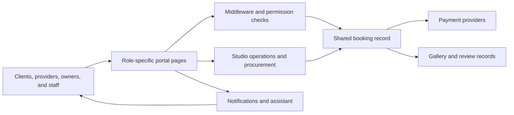
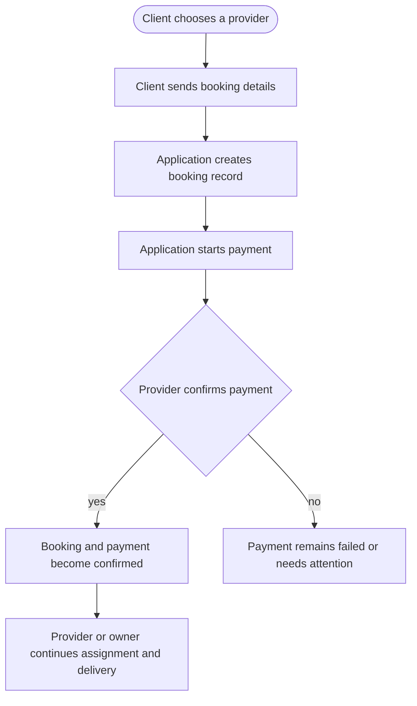
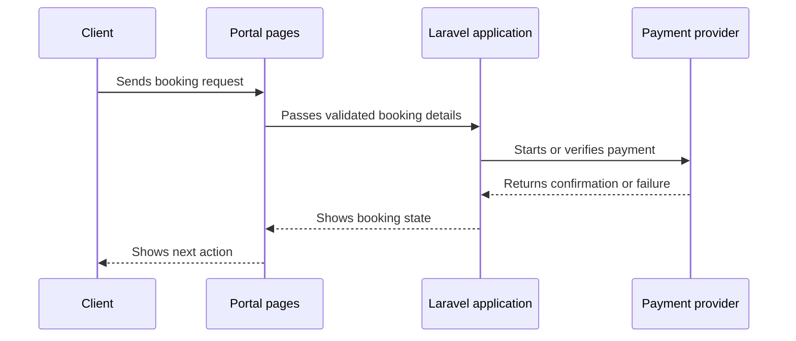
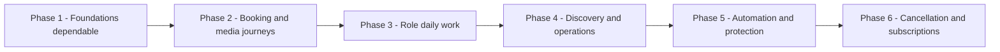
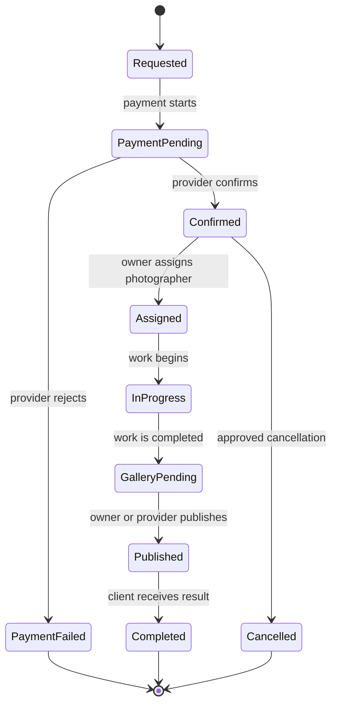
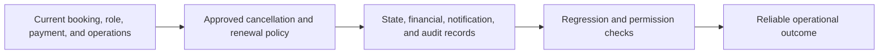

# 06 - DIAGRAMS

[Back to start](00%20-%20START%20HERE.md) · Previous: [05 - SYSTEM ARCHITECTURE](05%20-%20SYSTEM%20ARCHITECTURE.md) · Next: [07 - DEVELOPMENT ROADMAP](07%20-%20DEVELOPMENT%20ROADMAP.md)

These pictures use Mermaid. Each is followed by a plain-language reading. They show the current arrangement unless they are explicitly labelled proposed.

## 1. The big picture

**Reading this:** People enter through role-specific pages. Middleware and permissions decide which actions reach the shared booking and operational records. Payments, galleries, reviews, notifications, and the assistant connect around that shared core.

## 2. How a booking gets done

**Reading this:** The client supplies a booking, the application creates the shared record, and a payment provider message decides whether the booking can continue as confirmed. The exact financial and retry policy is outside what the current material settles.

## 3. Who talks to whom during payment

**Reading this:** The client begins the exchange. The application talks to the provider and then updates the shared records and portal response. A provider response is not itself a final product policy; the business outcome still has to be defined for unresolved cases.

## 4. The order of the phases

**Reading this:** The order starts with evidence, defects, and boundaries. Later work depends on the booking and role foundations. Phase 6 now records the approved photographer-recovery and subscription lifecycle outcomes; ordinary cancellation and other policy questions remain separate.

## 5. The life story of a booking

**Reading this:** A booking can fail before confirmation, move through assignment and gallery delivery, or enter the approved photographer-recovery path. Rejection, escalation, or deadline expiry leads to a queued full manual refund; ordinary cancellation remains separate.

## 6. The proposed arrangement

**Reading this:** The proposed work adds policy-backed outcomes around the existing core. It does not replace the current architecture. It first requires decisions, then records their consequences, then verifies that the role and studio boundaries still hold.
