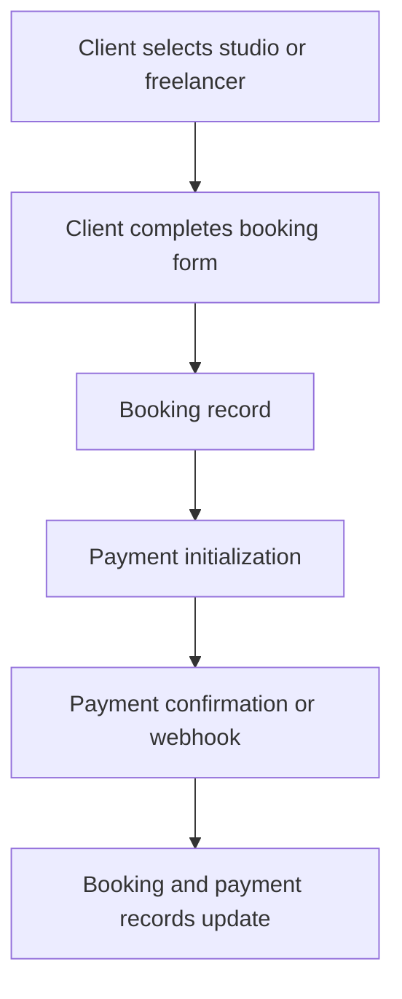
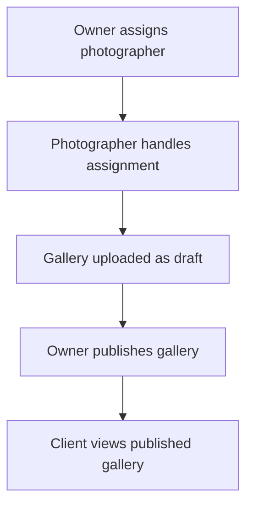
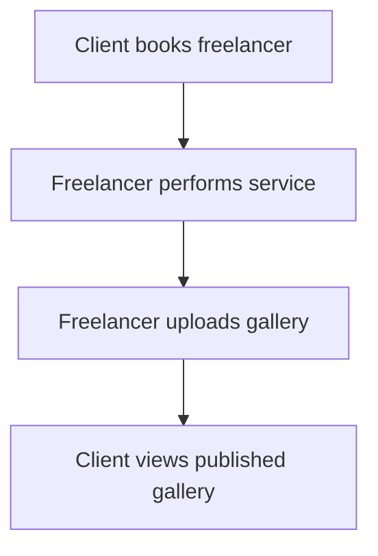

# Process Flows

> **In plain terms:** These diagrams show the current paths through booking, payment, and galleries. They do not add missing policy steps.

### DGM-001 — Booking and payment (as-is)

_Module: Booking and payment · [ANL-009](architecture.md#anl-009--booking-is-the-cross-portal-aggregate) · Sequence view: [DGM-007](../07-diagrams/process-booking.md#dgm-007--booking-and-payment-sequence-as-is)_

**In plain terms.** A client chooses a provider, submits booking details, and starts payment. A confirmation or verified provider message then updates the booking and payment records.

### DGM-002 — Studio gallery delivery (as-is)

_Module: Studio gallery · [ANL-009](architecture.md#anl-009--booking-is-the-cross-portal-aggregate) · Counterpart: none_

**In plain terms.** The owner assigns the work, the photographer handles it, and the gallery remains a draft until the owner publishes it for the client.

### DGM-003 — Freelancer gallery delivery (as-is)

_Module: Freelancer gallery · [ANL-009](architecture.md#anl-009--booking-is-the-cross-portal-aggregate) · Counterpart: none_

**In plain terms.** The client books a freelancer, the freelancer performs the service and uploads the gallery, and the client views the published result.
