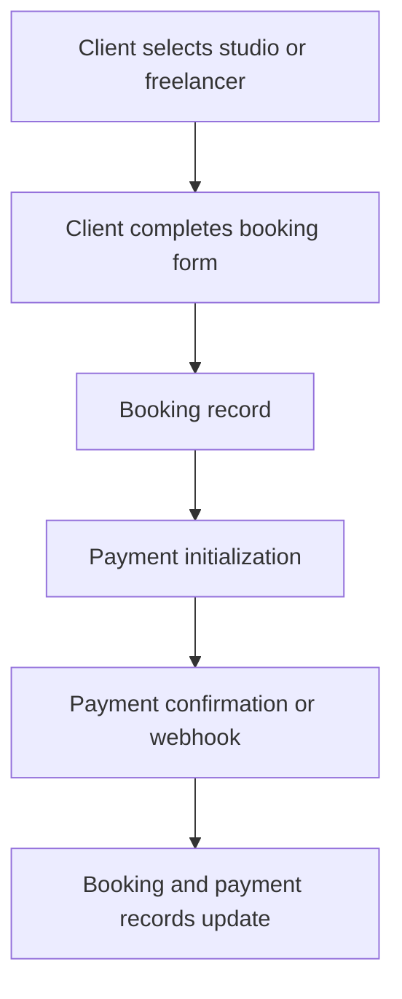
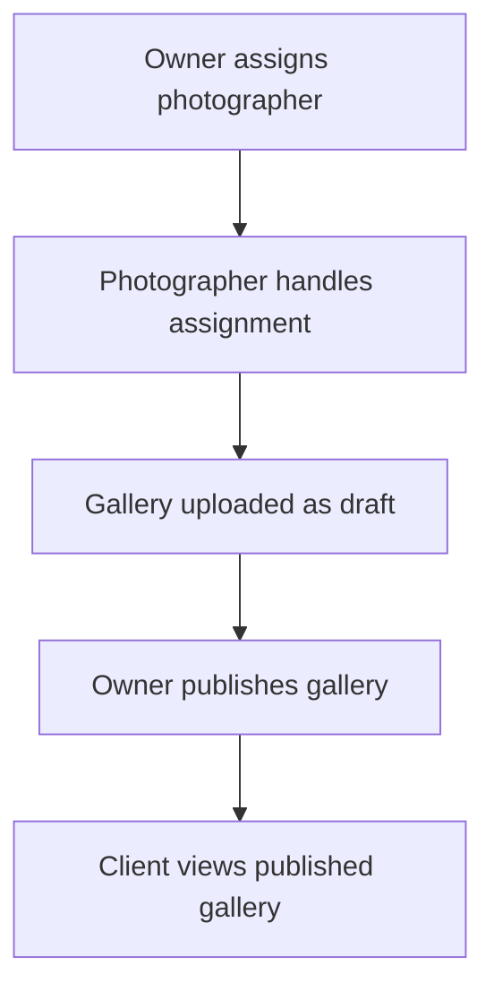
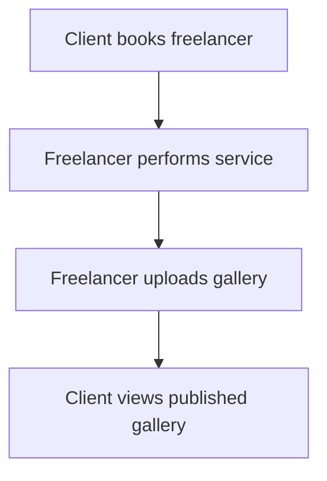

# Process Flows

> **In plain terms:** These diagrams show the current paths through booking, payment, and galleries. They do not add missing policy steps.

## Booking

## Studio delivery

## Freelancer delivery

