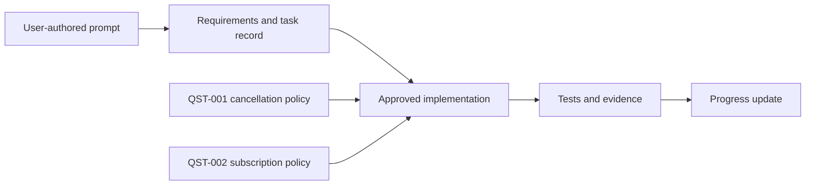

# Dependencies

> **In plain terms:** Approved work moves from a user-authored request through requirements, implementation, proof, and a progress update. The two open policy questions block only the implementations that depend on their answers.

Only policy-dependent implementation is blocked by `QST-001` or `QST-002`; analysis records are complete.
