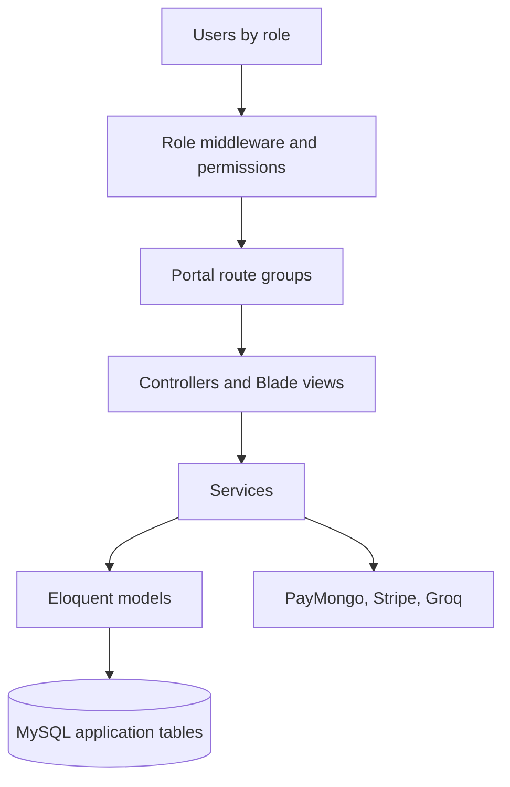

# Architecture Diagram

> **In plain terms:** This picture shows how user roles reach separate portal areas that share application services and records. It represents the current architecture.

### DGM-004 — Platinum application architecture (as-is)

_Module: Whole system · [ANL-003](../02-analysis/architecture.md#anl-003--portal-boundaries) · Counterpart: none_

**In plain terms.** A role check sends each person into the correct portal. Controllers and pages use shared services and database models, while payment and assistant services remain external connections.
