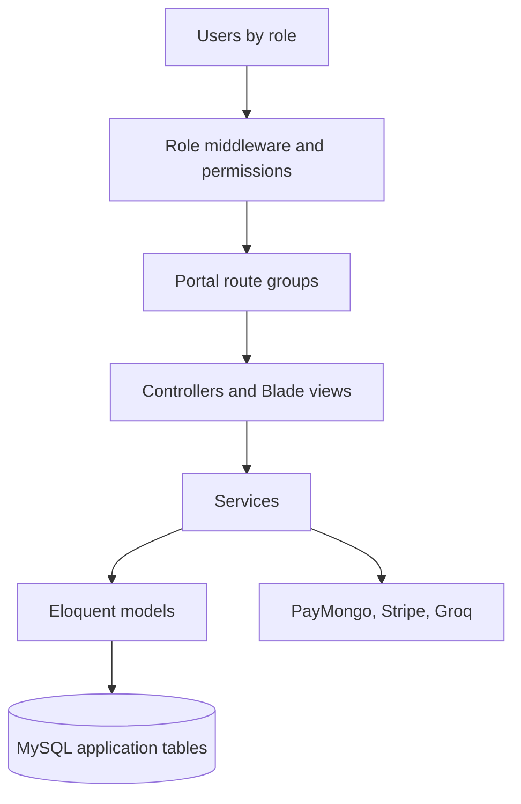

# Architecture Diagram

```mermaid
flowchart TB
    U[Users by role] --> R[Role middleware and permissions]
    R --> P[Portal route groups]
    P --> C[Controllers and Blade views]
    C --> S[Services]
    S --> M[Eloquent models]
    M --> DB[(MySQL application tables)]
    S --> X[PayMongo, Stripe, Groq]
```
