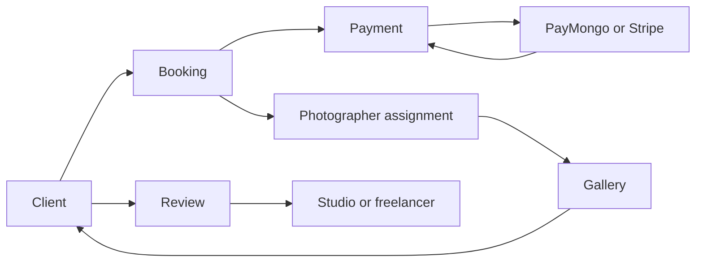

# Data Flow Diagram

> **In plain terms:** This picture follows booking, payment, assignment, and gallery information through the current system. It does not add a new data path.

### DGM-005 — Booking-to-gallery data flow (as-is)

_Module: Booking and delivery · [ANL-009](../02-analysis/architecture.md#anl-009--booking-is-the-cross-portal-aggregate) · Counterpart: none_

**In plain terms.** The booking connects a client to payment and, for studio work, a photographer assignment. The finished gallery returns to the client, who may then review the studio or freelancer.
