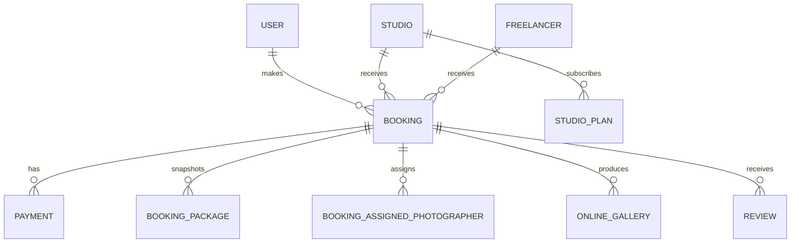

# Principal Data Relationships

```mermaid
erDiagram
    USER ||--o{ BOOKING : makes
    STUDIO ||--o{ BOOKING : receives
    FREELANCER ||--o{ BOOKING : receives
    BOOKING ||--o{ PAYMENT : has
    BOOKING ||--o{ BOOKING_PACKAGE : snapshots
    BOOKING ||--o{ BOOKING_ASSIGNED_PHOTOGRAPHER : assigns
    BOOKING ||--o{ ONLINE_GALLERY : produces
    BOOKING ||--o{ REVIEW : receives
    STUDIO ||--o{ STUDIO_PLAN : subscribes
```

This is a conceptual map, not a column-level schema. Migrations remain the schema authority.
