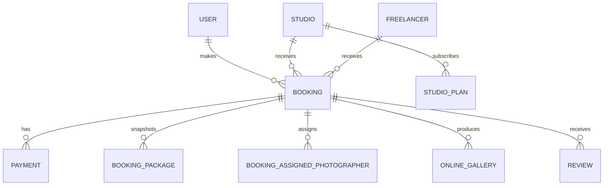

# Principal Data Relationships

> **In plain terms:** This picture shows how the main people, studios, bookings, payments, assignments, galleries, and reviews relate. It is a focused map rather than every database table.

### DGM-006 — Principal application records (as-is)

_Module: Database · [ANL-004](../02-analysis/database.md#anl-004--seed-data-contracts) · Counterpart: none_

**In plain terms.** A booking belongs to the client and a studio or freelancer, then connects to payment, package, assignment, gallery, and review records. Studio subscription plans are related to studios separately.

**Limitation.** This is a conceptual map, not a column-level schema. Migrations remain the schema authority.
