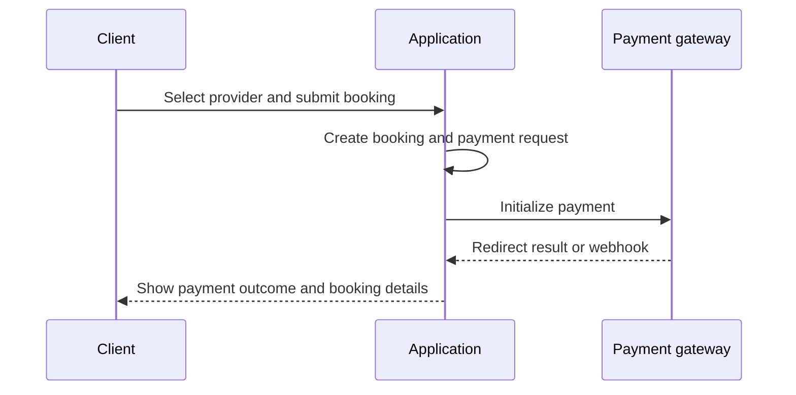

# Booking Process Diagram

> **In plain terms:** This picture follows a client booking from provider selection through payment confirmation. It reflects the documented current process.

### DGM-007 — Booking and payment sequence (as-is)

_Module: Booking and payment · [ANL-009](../02-analysis/architecture.md#anl-009--booking-is-the-cross-portal-aggregate) · Flowchart view: [DGM-001](../02-analysis/process-flows.md#dgm-001--booking-and-payment-as-is)_

**In plain terms.** The client submits a booking, the application creates its records, and the payment provider returns an outcome by redirect or verified message. The application then shows the resulting booking and payment state to the client.
