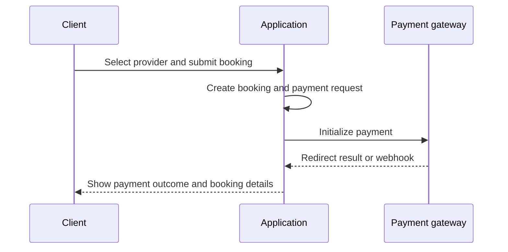

# Booking Process Diagram

```mermaid
sequenceDiagram
    participant C as Client
    participant A as Application
    participant G as Payment gateway
    C->>A: Select provider and submit booking
    A->>A: Create booking and payment request
    A->>G: Initialize payment
    G-->>A: Redirect result or webhook
    A-->>C: Show payment outcome and booking details
```
