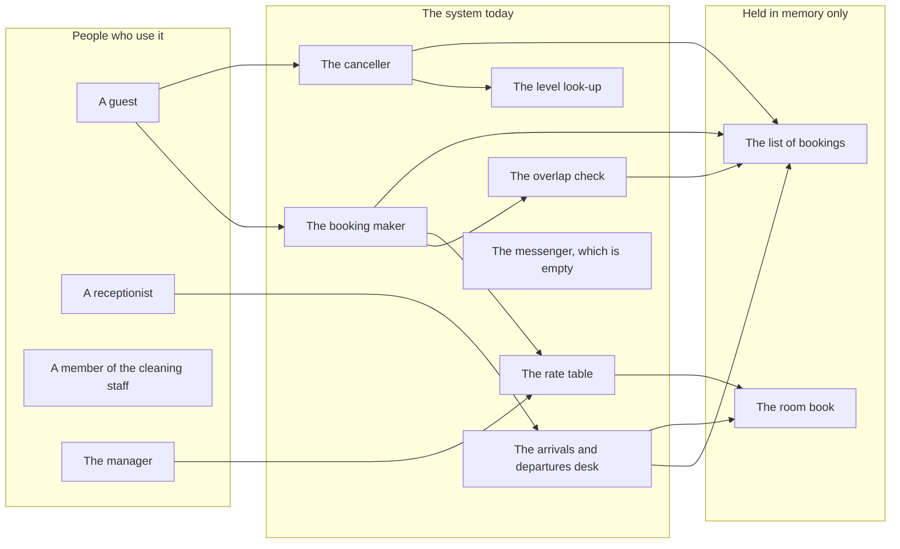
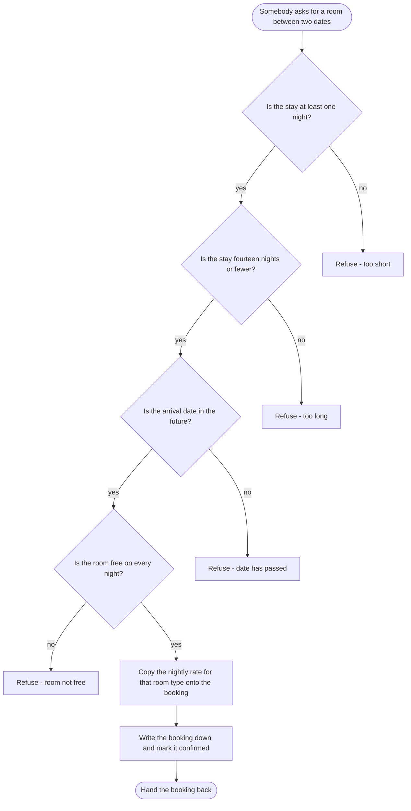
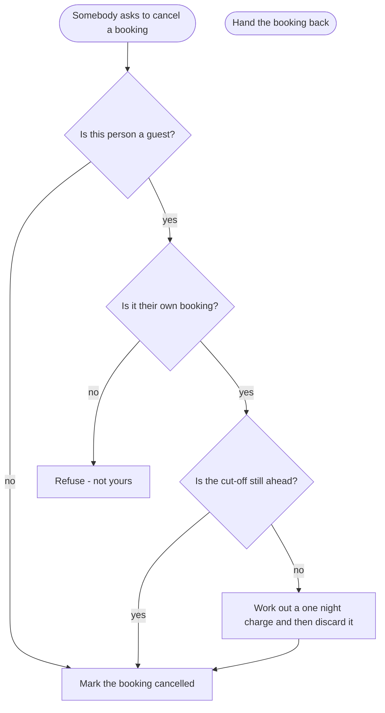
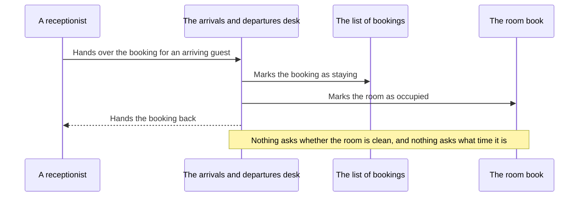
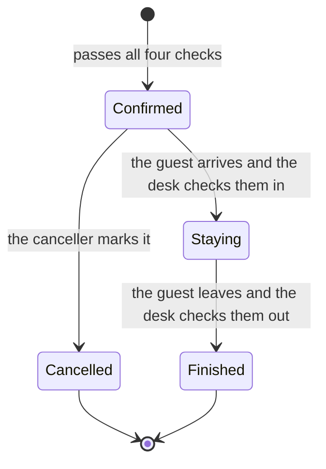
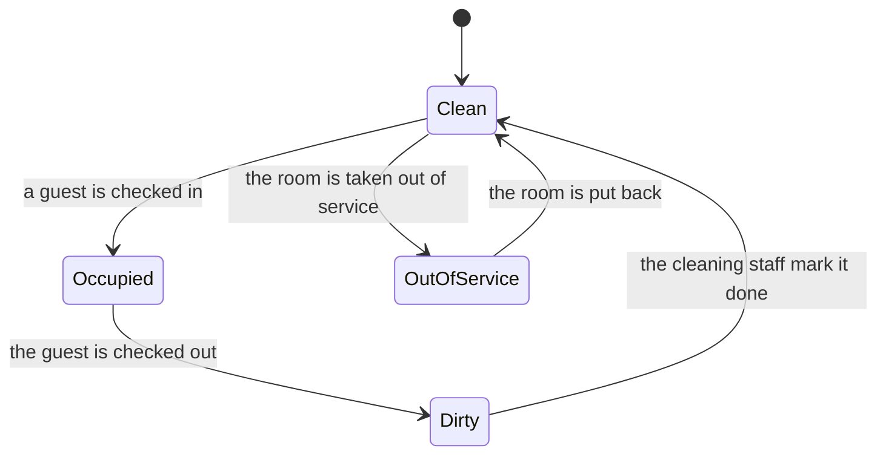
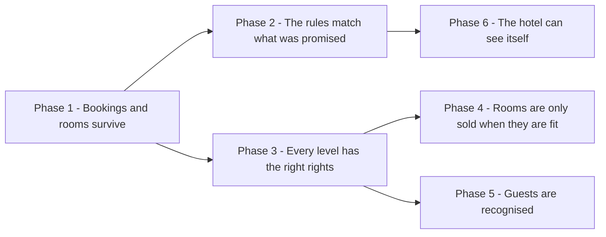
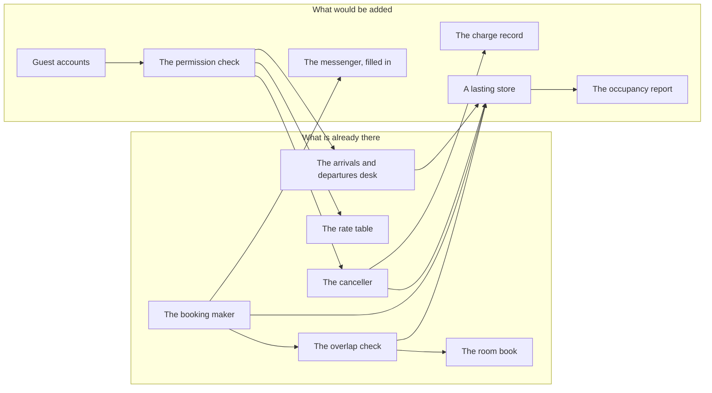

# 06 - DIAGRAMS

[[00 - START HERE|Back to start]] · Previous: [[05 - SYSTEM ARCHITECTURE]] · Next: [[07 - DEVELOPMENT ROADMAP]]

Pictures of how this works. Each one has a plain-language reading beneath it, so nothing here depends on being able to read a diagram.

## 1. The big picture

**Reading this:** Start at the people on the left. A guest reaches two parts — the booking maker, to book a room, and the canceller, to give one up. A receptionist reaches the arrivals and departures desk. The manager reaches the rate table, though nothing stops anybody else reaching it too. The cleaning staff, on the left, reach nothing at all: the two pieces that mark a room clean or out of service exist in the room book and no part of the system ever calls them.

Across the middle, the booking maker asks the overlap check whether a room is free and the rate table what a night costs, then writes into the list of bookings. The canceller asks the level look-up who it is dealing with. On the right, everything is held in the program's own memory and nothing else — both stores empty themselves every time the program stops.

Two absences are the point of this picture. Nothing reaches the messenger, so no guest is ever emailed. And nothing joins the room book to the overlap check, so a room's state has no bearing on whether it can be sold. Matches the description in [[05 - SYSTEM ARCHITECTURE]] — if the two ever disagree, the words win and the picture gets fixed.

## 2. How a job gets done — making a booking

**Reading this:** Four questions in a row, and any one of them can end the journey. The length of the stay is checked twice, against a floor of one night and a ceiling of fourteen — `booking_service.py`, lines 40 to 43. The arrival date is checked against today — lines 44 to 45. The room is checked against every booking already made, on every night of the stay — lines 46 to 47, using the overlap check at lines 27 to 35.

Only after all four does anything get written. The rate is copied from the rate table onto the booking at line 56, which quietly means a later price change never alters a booking already made. The booking is written down and marked confirmed at lines 49 to 59.

Every refusal is a short phrase meant for whoever built the program, not for a guest. Nothing at all happens after the booking is saved — the confirmation email the specification promises is not on this path, because nothing calls the messenger.

## 3. How a job gets done — cancelling a booking

**Reading this:** This is the diagram worth studying, because the shape of it is the problem.

The very first question is *is this person a guest* — `booking_service.py`, line 65 — and a **no** goes straight to cancelling with no further questions asked. Receptionists, the manager, and the cleaning staff all take that path. The specification gives the power to cancel anything only to receptionists, `Requirements.md`, *Rules* item 8, so two of those three groups have it by accident. This is [[04 - COMBINED FINDINGS#Where they flatly contradict each other|K-02]].

Down the guest path, two tests apply. Somebody else's booking is refused at line 67. Then the cut-off is checked at line 68 — and look at where both arrows go. Whether the guest is inside the cut-off or outside it, the booking is cancelled at line 71 either way. Inside the cut-off a charge is worked out at line 69 and immediately discarded. So the cut-off changes nothing that anybody could notice.

The picture the specification describes would ask *is this person allowed to cancel this booking* as a single question, and would stop a late cancellation until the charge was accepted. Neither is what is drawn here.

## 4. Who talks to whom, in order — checking a guest in

**Reading this:** Time runs downwards. The receptionist starts it by handing over a booking. Solid arrows are requests going out; the dashed arrow is the answer coming back.

The whole exchange is two changes and a reply — `booking_service.py`, lines 78 to 80. What is missing is the note at the bottom. The specification requires a room to be marked clean before anybody is put in it, `Requirements.md`, *Rules* item 6, and requires check-in to be from 2pm, *Rules* item 4. Neither happens. Two notes left in the working file at lines 76 and 77 admit both.

Nobody is asked whether this receptionist is allowed to check anybody in, either. The desk is reachable by anyone who can reach it.

## 5. The life story of a booking

**Reading this:** A booking starts as confirmed the moment it passes the four checks — there is no held or pending state, and no waiting list.

From confirmed it goes one of two ways. Cancelled, when the canceller marks it at line 71. Or staying, when the desk checks the guest in at line 78, and then finished when they check out at line 84.

Two things are worth noticing. Nothing stops a booking already marked staying from being cancelled — no state is protected from any move. And there is no state at all for a guest who never turned up; the desk today simply leaves such a booking in the paper diary, which is recorded as an open matter in `Handover Notes.md` and raised as [[00 - START HERE#Open questions|Q-06]].

Neither cancelled nor finished can be reversed by anything in the working files.

## 6. The life story of a room

**Reading this:** Every room begins clean when the program starts — `rooms.py`, lines 8 to 13.

The loop across the top runs by itself: the desk moves a room to occupied on arrival, line 79, and to dirty on departure, line 85. The move back from dirty to clean is the only one a person has to do deliberately, and although the piece that does it exists at `rooms.py`, lines 36 to 37, nothing in the system ever calls it. So in practice a room goes dirty and stays dirty.

Out of service works the same way — the piece exists at lines 44 to 46 and nothing calls it. Both arrows into and out of that state are drawn from what those pieces do, not from anything either document describes; the handover meeting asked for the state and said nothing about who puts a room back, which is [[00 - START HERE#Open questions|Q-07]].

The state that matters most is missing from the picture entirely, because it has no effect: whatever state a room is in, the overlap check never looks, and the room is sold anyway.

## 7. The order of the phases

**Reading this:** An arrow means the phase it points at cannot start until the phase behind it is finished.

Phase 1 starts, and everything waits on it — there is no point building anything on top of a system that forgets everything when it stops.

After Phase 1 the plan splits in two, and the two halves do not need each other. Phase 2 corrects the rules that already exist. Phase 3 builds a real permission arrangement. They can run alongside.

Phase 4 waits on Phase 3, because making rooms unsellable means handing the cleaning staff a lever, and their rights today are an accident rather than a decision. Phase 5 also waits on Phase 3, because the permission check is the first thing that genuinely needs to know who somebody is.

Phase 6 waits on Phase 2, because the occupancy figure and the cancellation charge both need the corrected rules underneath them. Matches [[07 - DEVELOPMENT ROADMAP]] exactly.

## 8. The proposed arrangement

**Reading this:** Six parts already exist and six would be added.

The lasting store replaces the two memories on the right of the first picture. Four existing parts read and write there instead, which is why it has to come first — leaving it later means changing all four of them twice.

The permission check is the new middle of the arrangement. Rather than each part working out for itself who it is dealing with, three of them ask the same part the same kind of question. Guest accounts feed it, which is why accounts come after it and not before: nothing needs a reliable answer to *who is this* until something is asking.

Two smaller additions hang off the edges. The charge record holds what a late cancellation owes, so the desk can collect it — this is the piece that is worked out and thrown away today. The occupancy report reads the store and counts, and needs nothing else.

One arrow is new between two parts that already exist: the overlap check now asks the room book what state a room is in, which is what stops an out-of-service room being sold. Each problem these fix is cited in [[05 - SYSTEM ARCHITECTURE#What changes and why]].
