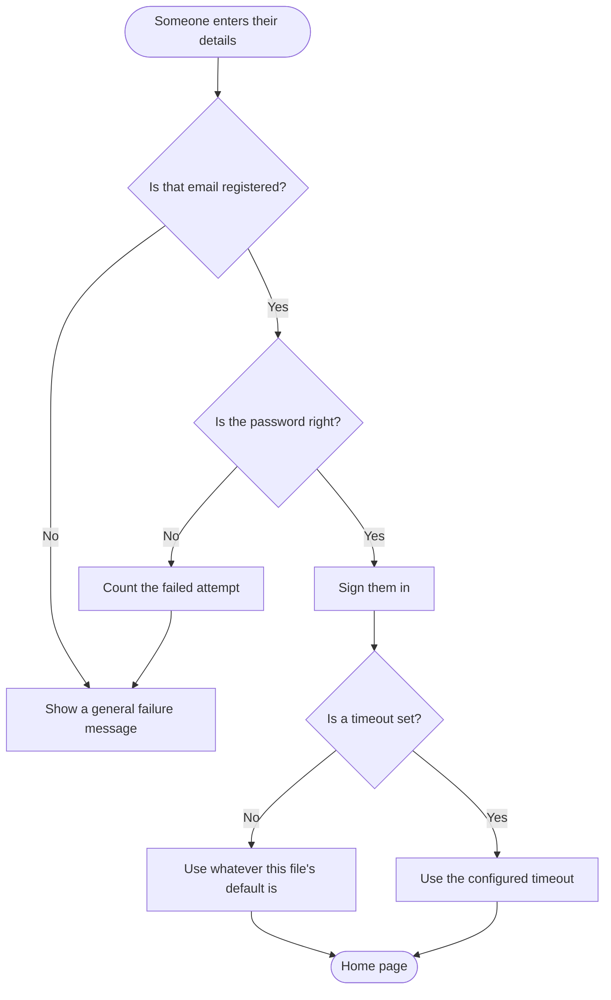

# Draw the Pictures

> Plain-language version. Does the same job as `08 - DIAGRAMS.md` in `WORKFLOW - TECHNICAL/` — same steps, same output files, simpler words.

---

## Who you are for this
Someone who draws what the system actually does — not what it was supposed to do. Pictures are part of the work, not decoration added at the end.

---

## Rules that never bend

**1. One picture per process.** If a section has three processes, that's three pictures. Squeezing them into one to save space makes all three unreadable.

**2. Write the pictures as text, never as screenshots.** Text-based diagrams can be edited, show what changed between versions, and can't quietly go out of date the way an image can. Use Mermaid — it draws itself inside a Markdown file.

**3. Every picture is linked from the document that talks about it.** A picture nobody links to is a picture nobody updates.

---

## What to draw

| Picture | One for each | When |
|---|---|---|
| **A process** | Each separate process | Always — this is the important one |
| **The whole structure** | The system | Always |
| **How information moves** | The system | Always |
| **The database** | The database | Whenever there is one |
| **A conversation between parts** | Each multi-step exchange | Signing in, payments, anything talking to an outside service |
| **The life of a thing** | Anything that moves through stages | Requests, orders, tickets |

**Before and after.** If something already exists and is changing, draw it both ways — how it works now, and how it will work. **The difference between the two pictures is the actual work**, and it's the clearest thing you can put in front of a panel. For a new system, only the "after" exists.

---

## What each picture needs
A number, a caption saying which process and section it shows and whether it's the before or after version, what it connects to, and — underneath — a short explanation in ordinary words.

````markdown
### DGM-004 — Signing in (how it works now)
_Section: Sign-in · Comes from ANL-009 · The "after" version: DGM-005 · Changed by TASK-014_



**What this shows.** When someone tries to sign in, the system checks their email,
then their password, then remembers them as signed in. The step marked "use whatever
this file's default is" is where the three copies of this logic currently disagree
with each other — which is the whole reason this needs fixing.
````

**The explanation underneath is not optional.** It's what lets one picture serve both a developer and someone's thesis panel. Without it you need two documents, and they'll drift apart.

---

## How to draw them
- Rounded shapes for where something starts and ends
- Rectangles for things that happen
- Diamonds for decisions, with the answers written on the lines
- Keep the words inside each box short — the explanation goes underneath, not inside

For a database picture, show the real relationships — which table connects to which, and whether it's one or many. For a conversation picture, name each part exactly as it's named in the code, not generically.

---

## Keeping them true
A picture becomes wrong the moment the code changes and the picture doesn't.

That's why updating the picture is part of finishing the task that changed it — not a tidy-up afterward. Tidy-ups don't happen.

If you find a picture that no longer matches the code, **don't quietly correct it.** Write down that they'd drifted apart, first. The gap between the drawing and the reality is itself worth knowing about — it usually means something was changed without anyone updating what people rely on.

---

## What you'll end up with

```text
07-diagrams/
├── architecture.md          the whole structure
├── data-flow.md             how information moves
├── erd.md                   the database
├── process-<section>-<name>-as-is.md    how it works now
├── process-<section>-<name>-to-be.md    how it will work
└── sequence-<name>.md       conversations between parts
```

---

## Before you call it finished
- [ ] Every separate process has its own picture
- [ ] Everything that's changing has both a "now" and a "will be" version
- [ ] The structure, the information flow, and the database are all drawn
- [ ] Every multi-step exchange has a conversation picture
- [ ] Every picture has a number, a caption, and an explanation in ordinary words
- [ ] Every picture is linked from the document that discusses it
- [ ] Nothing is a screenshot

---

## Fill this in

**Where the project is:** `<folder or repository>`
**What to draw:** `<which processes or sections, or "everything">`
**Which version:** `<"how it works now" | "how it will work" | "both">`
**Where to save the pictures:** `<folder — usually the project's main folder>`
