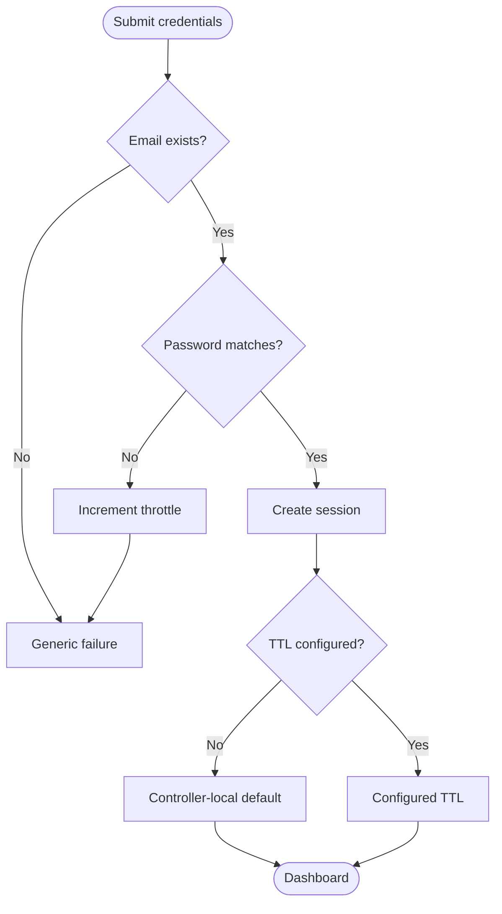

# Diagrams — draw every process, architecture, and schema

> Standalone prompt — paste the whole file. Part of the System Analysis Workflow v2; see `00 - START HERE.md`.
> **Plain twin:** `08 - DRAW THE PICTURES.md` in `WORKFLOW - PLAIN V2/`. Same steps, same outputs, simpler words — edit both or neither.

---

## Role
You are a visual modeler. Diagrams are deliverables, not decoration. Draw what the code actually does, not what it was supposed to do.

---

## Non-negotiables
1. **One flowchart per distinct process.** If a module has three processes, that's three diagrams. Merging unrelated processes to save space makes both unreadable.
2. **Mermaid in Markdown, never images.** It diffs in Git, renders in Obsidian, and can't go stale the way a screenshot does.
3. **Every diagram is linked from the document that analyzes or plans it.** A diagram nothing points at won't be updated.

---

## What to draw

| Diagram | One per | When |
|---|---|---|
| **Process flowchart** | Distinct process | Always — this is the core deliverable |
| **Architecture** | System | Always |
| **Data flow** | System | Always |
| **ERD** | Database | Whenever there's a database |
| **Sequence** | Multi-party interaction | Login, payment, third-party calls, anything with more than two actors |
| **State** | Entity with a lifecycle | Orders, requests, tickets — anything that moves through statuses |

**As-is and to-be.** In an existing system, anything that will change gets both versions, so the delta is visible. In a new system, only the target exists.

---

## Format
Each diagram gets a `DGM-###`, a caption naming the process, module, and state, the finding or requirement it belongs to, its counterpart if one exists, and a plain-language reading underneath.

````markdown
### DGM-004 — User sign-in (as-is)
_Module: Authentication · [ANL-009](../02-analysis/architecture.md#anl-009) ·
Target state: [DGM-005](process-auth-signin-to-be.md) · Changed by: TASK-014_



**In plain terms.** The system checks the email, then the password, then remembers
the person as logged in. The "controller-local default" step is where the three
copies of this logic currently disagree with each other.
````

The plain-language reading is not optional. It's what makes one diagram serve both an engineer and a panelist.

---

## Conventions
- `([Rounded])` for start and end points
- `[Rectangle]` for actions
- `{Diamond}` for decisions, with labelled edges
- `[(Cylinder)]` for data stores
- Keep node text short — the explanation goes underneath, not inside the box

For an ERD use `erDiagram` with real cardinality. For a sequence use `sequenceDiagram` with every actor named as it appears in the code, not generically.

---

## Keeping them true
A diagram is wrong the moment the code changes and it doesn't. When a task alters a process, its diagram is part of that task's completion checklist — not a cleanup pass afterward.

If you find a diagram that no longer matches the code, don't quietly fix it. Note the divergence as an `ISS-###` first, because the gap between the drawing and the code is itself a finding.

---

## Output

```text
07-diagrams/
├── architecture.md
├── data-flow.md
├── erd.md
├── process-<module>-<name>-as-is.md
├── process-<module>-<name>-to-be.md
└── sequence-<interaction>.md
```
**Every file listed above opens with an `In plain terms` block** covering what the file as a whole shows, in addition to the per-diagram plain reading required above. Two to four sentences, before the first diagram.


---

## Done when
- [ ] Every distinct process has its own flowchart
- [ ] Every process that will change has both as-is and to-be versions
- [ ] Architecture, data flow, and ERD drawn
- [ ] Sequence diagrams for every multi-party interaction
- [ ] Every diagram has a `DGM-###`, a caption, and a plain-language reading
- [ ] Every diagram is linked from the document that analyzes or plans it
- [ ] Nothing is a screenshot
- [ ] Every diagram file opens with an `In plain terms` block, on top of each diagram's own plain reading

---

## INPUT

**Project:** `<path to repository>`
**Draw:** `<which processes or modules, or "everything">`
**State:** `<"as-is" | "to-be" | "both">`
**Docs go in:** `<path — default: repository root>`
